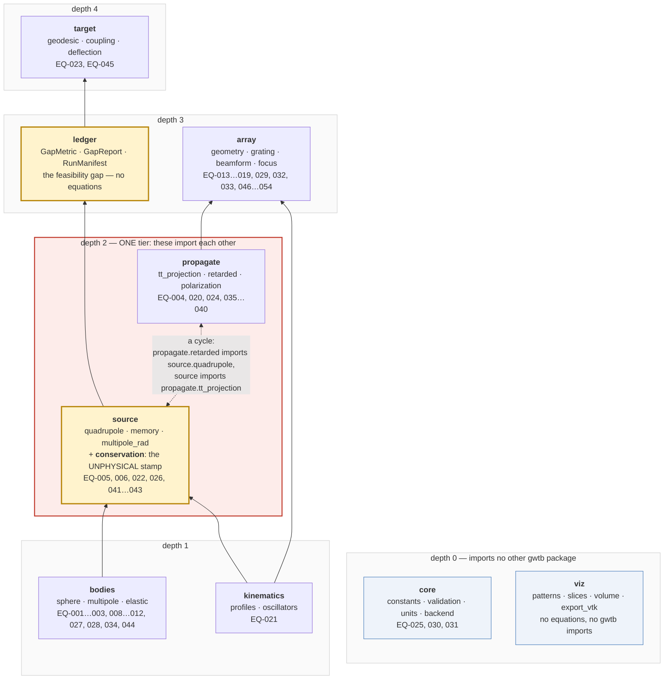
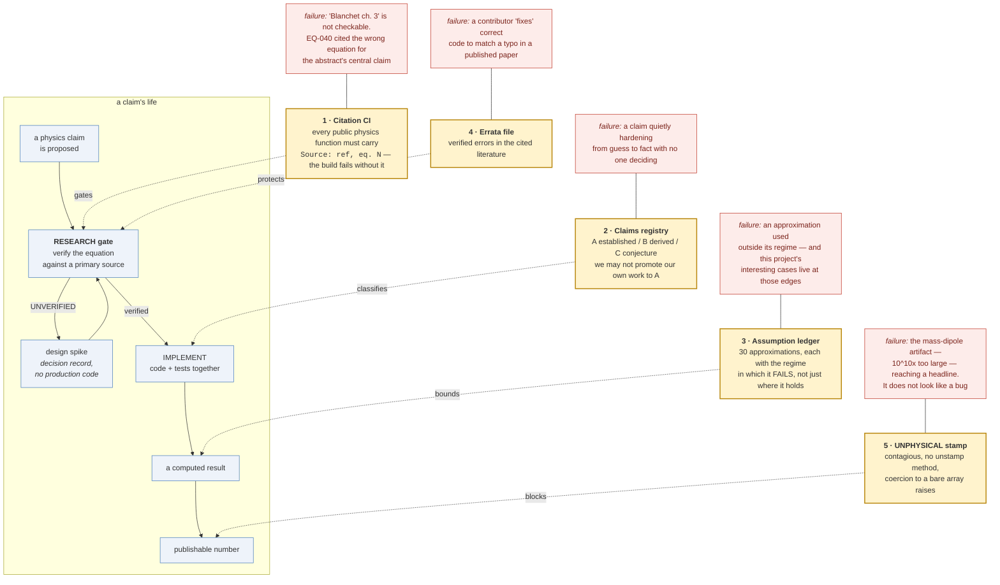

# Provenance-enforced simulation of engineered gravitational radiation: a spin-2 phased-array framework with a quantified feasibility ledger

**DRAFT — not for circulation.** Target format: *Nature* Article (Main ≤ 3,000 words;
Methods unlimited; ≤ 50 references; ≤ 6 display items in the main text; Extended Data
≤ 10 items). Section headings follow *Nature*'s Article template.

> **Reading note.** Every paragraph of content in this draft is followed by a
> ***Non-expert summary*** — a plain-language restatement of what that paragraph says,
> written for a reader with no physics training. These are **drafting aids, not part of
> the manuscript**, and must be stripped before submission. They exist so that a
> non-specialist author, collaborator, or reviewer can follow the argument end to end and
> challenge it. If a summary and its paragraph disagree, the paragraph is what the
> manuscript claims — but the disagreement is a bug worth chasing, because it usually
> means the paragraph is unclear rather than that the summary is wrong.

> **Status of this draft.** Main, Discussion, Methods **and Results** are written. The
> Results section was drafted as a pre-registration and the campaign has since been run
> (2026-08-03); its questions and falsifiers are unchanged from before the run. Five
> figures and both data tables are populated from `docs/paper/campaign/`. Numbers here are
> either committed test/benchmark outputs or campaign outputs, and each is traceable to a
> named test or a campaign JSON — see §"Numbers in this draft".
>
> **Outstanding:** figures are draft-quality and are the author's to refine; the repository
> is not yet public; and there is no author list or `CITATION.cff`. See §Submission notes.

***Non-expert summary:*** This paper is half-written on purpose. The parts explaining
*what we built* and *how it works* are done. The part reporting *what we found when we
ran it* is deliberately left as an empty, pre-filled-in outline — we wrote down what
we're going to measure and what result would prove us wrong **before** running anything,
so we can't quietly move the goalposts later. Any number you see in this draft today
comes from a test that already runs, not from a result we're hoping for.

---

## Author list

Paul Day1

1Independent researcher.

Correspondence: dpaulday@protonmail.com

**ORCID: to be registered before submission.** A project intended to outlive its authors
needs a durable identifier that survives an email address and a code-hosting handle; a
GitHub username is not one.

***Non-expert summary:*** Who wrote this, and how to reach them. One outstanding item: a
permanent researcher ID number, which matters more here than usual because the project is
meant to continue long after the people who started it have stopped.

---

## Author contributions

**P.D.** conceived the project, set its scope and governance rules, made every scoping and
acceptance decision, and is accountable for all claims herein. CRediT: conceptualization,
methodology, software, validation, formal analysis, investigation, data curation,
writing — original draft, writing — review and editing, supervision, project administration.

**AI assistance, disclosed.** This work was produced with extensive assistance from
Anthropic's Claude, used for implementation, derivation, literature verification, review and
drafting. As of commit `93f215c` (2026-08-06), 55 of 61 commits carry a `Co-Authored-By`
trailer naming the model — 35 Claude Opus 5, 20 Claude Sonnet 5 — and those trailers, not
this paragraph, are the authoritative record.

**The models are not authors and are not eligible to be.** Nature, Science and all
Springer-Nature journals hold that Large Language Models do not satisfy authorship
criteria, because authorship carries accountability that cannot be assigned to a
tool23. Disclosure is required; authorship is prohibited. Accountability for
every claim here rests with the human author.

We report this in unusual detail because the project's own README states a falsifiable
hypothesis about whether AI tooling lets an educated amateur produce work consistent with
the literature — and because the honest answer includes the failures. Over the development
period the framework's own audit machinery found **seven defects in its own records**,
including a citation that pointed at the wrong equation for the manuscript's central claim
(EQ-040), an alignment-precision figure quoted more tightly than any test enforced, and an
architecture description contradicted by the import graph. Each is logged with a date and a
reason in `docs/CLAIMS.md` rather than silently corrected. A case study that reported only
the successes would be measuring the wrong thing.

***Non-expert summary:*** Who did what, and an unusually detailed account of how much of
this was done with AI help. The short version: a lot — roughly nine commits in ten involved
it. The AI is deliberately **not** listed as an author, because every major scientific
publisher forbids it: being an author means being answerable for the work, and a tool
cannot be answerable. So the human is accountable for all of it, and the AI use is
disclosed instead. We give the numbers rather than a vague acknowledgement because this
project has publicly bet that this way of working can produce sound results — and a bet
you report selectively isn't a bet. That includes listing the seven mistakes the project
caught in its own paperwork.

---

---

## Abstract

*(target 150–200 words; current draft ≈ 195)*

Gravitational radiation is a spin-2 field, and the phased-array formalism that governs
coherent electromagnetic apertures does not carry over to it unchanged. We present
`gwtb`, an open-source framework that models the generation, propagation, coherent
superposition and target coupling of gravitational radiation from arrays of
controllably accelerated masses, together with the first systematic derivation of
array-theoretic quantities — element mismatch, array gain, alignment tolerance,
focusing phase — for a spin-2 rather than a spin-1 field. Polarization rotates as
e^(2iψ), so the element-to-element mismatch factor is cos(2Δψ) rather than cos(Δψ);
elements 90° apart cancel completely where electromagnetic intuition predicts a
doubling of power, and the orientation tolerance for 1% gain loss is exactly twice as
tight. Because such results have no external reference implementation to check against,
the framework's second contribution is architectural: every implemented equation carries
a machine-checked citation to a numbered equation in an open-access source, every claim
is registered as established, derived or conjectural, every approximation is recorded
with the regime in which it fails, and results computed from momentum-non-conserving
sources are cryptographically inseparable from an `UNPHYSICAL` provenance stamp.

**Keywords:** gravitational waves; linearized gravity; phased arrays; spin-2 fields;
research software engineering; computational reproducibility; planetary defence.

***Non-expert summary:*** Radio engineers know how to combine many antennas so their
signals reinforce each other in one direction — that's a "phased array," the technology
behind radar and 5G. We asked whether the same trick works for gravitational waves
(ripples in space itself). The answer is **yes, but the rules are different**, because
gravity's waves have a different symmetry from radio waves. Concretely: two gravitational
emitters turned 90° apart from each other **cancel out to nothing**, whereas two radio
antennas in the same arrangement would give you double the power. Get that wrong and your
array radiates silence while you confidently expect twice the output. Since nobody has
built one of these, there's no existing software to check our answers against — so the
paper's second half is about making the code itself auditable: every formula must cite a
specific numbered equation in a paper anyone can open, and any result computed from a
physically impossible setup gets permanently branded as such, in a way the software will
not let you remove.

---

## Main

The detection of gravitational waves1 established that spacetime strain
propagates, superposes and can be measured. It did not establish that gravitational
radiation can be *engineered* — deliberately generated, phased, steered and delivered.
That question is treated seriously in only a small and uneven literature, and it is
adjacent to a body of work on "high-frequency gravitational waves" that a JASON review
commissioned by the U.S. Office of the Director of National Intelligence found to be
fundamentally in error2. The credible prior art on deliberately generated
gravitational radiation is narrow — the electromagnetic-cavity emission analysis of
Grishchuk and Sazhin3 is its canonical entry.

***Non-expert summary:*** In 2015 scientists finally *detected* gravitational waves
arriving from colliding black holes, which proved these ripples are real and behave as
predicted. That is very different from being able to *make* them on purpose and aim them
somewhere. Almost nobody has studied the "make them" question seriously — and the people
who claimed to have solved it were investigated by a US government scientific review panel
and found to be plainly wrong. So this is a field with a small amount of good work and a
notable amount of discredited work, which shapes everything that follows.

This history creates an unusual methodological requirement. A framework in this problem
domain that reports a favourable number is, on its face, indistinguishable from the
discredited literature. The distinguishing property cannot be the result; it must be the
*apparatus that produced the result* — specifically, whether that apparatus is capable
of stating its own distance from the claim it is adjacent to, and whether it can be
audited by a reader who does not trust its authors.

***Non-expert summary:*** Here's the awkward problem. If our software spits out an
encouraging number, that alone looks *exactly* like the discredited work — encouraging
numbers are what those people produced too. So a good result cannot be what makes us
credible. The only thing that can is the machinery: can the tool honestly report how far
short it falls, and can a total stranger who assumes we're either fooling ourselves or
lying check every step? We designed for a hostile reader, not a friendly one.

We therefore built `gwtb` to two specifications simultaneously. As physics, it is a
linearized-gravity source-and-propagation code: retarded multipole expansion,
transverse-traceless projection, coherent superposition across an array of sources,
and explicit coupling channels at the target. As software, it is an *auditable* object:
citation discipline is enforced in continuous integration, claims are separated into
established physics, our derivations and open conjecture, approximations are catalogued
with their breakdown regimes, and a quantitative feasibility ledger is emitted on every
run stating how far the modelled configuration sits from the application it is motivated
by.

***Non-expert summary:*** So the software has two jobs at once. Job one is ordinary
physics: work out what gravitational waves a set of moving masses produces, how those
waves travel, how they combine, and what they do on arrival. Job two is bookkeeping with
teeth: the code refuses to build unless every formula cites its source; claims are sorted
into "textbook fact," "our own reasoning," and "guess"; every simplifying assumption is
written down *along with the conditions under which it stops being true*; and every single
run prints a scorecard of how far the design is from actually working.

### The physics gap that motivates the architecture

Three properties of the problem drive nearly every design decision.

***Non-expert summary:*** Three facts about this particular physics problem dictated
almost every choice we made in building the software. They're covered one at a time below.

**The regime is deeply linear.** Strains in any configuration this framework models are
of order h ~ 10⁻⁴⁰ — forty orders of magnitude inside the perturbative regime. Numerical
relativity, the standard tool for gravitational-wave source modelling, exists to handle
the strong-field region near merging compact objects and is the wrong instrument here:
it would solve a nonlinear partial differential equation to recover, at great cost, what
a linear integral gives exactly, on grids sized in geometric units of the source mass
rather than the 6 × 10¹² m of the engagement geometry. More importantly, linearity is
not a simplification we accept reluctantly. **Superposition holds exactly in the linear
regime, and without exact superposition the phrase "phased array of gravitational-wave
sources" has no referent.** The choice of formalism is what makes the concept coherent
enough to model at all.

***Non-expert summary:*** The effects here are unimaginably tiny — a number with forty
zeros after the decimal point. That's actually good news, twice over. First, it means we
can skip the monstrously expensive supercomputer methods built for violent events like
black-hole collisions; those tools are designed for a regime we never come close to
entering, and using them here would be like running a crash simulation to work out how
much a feather bends. Second, and more importantly, when effects are this small they
simply **add together**, cleanly and exactly. That matters enormously, because "combine
many sources so they reinforce each other" only means anything if the sources add. The
whole idea depends on being in this gentle regime.

**The leading radiation is quadrupolar, and this is a constraint on the concept, not a
detail of the implementation.** Expanding the retarded integral in multipoles, the mass
monopole is conserved and does not radiate; the mass dipole's second derivative is the
net external force, which vanishes for an isolated system; the mass quadrupole is the
first non-vanishing term4. It is tempting, when modelling a mass that is
"made to accelerate", to leave the accelerating agent out of the model. Doing so
silently breaks momentum conservation and promotes a mass-dipole term that is roughly
**10¹⁰ times** the true quadrupole signal. That artifact does not present as a bug. It
presents as a breakthrough. Guarding against it is the single most load-bearing
requirement on the software (Methods, "Conservation auditing").

***Non-expert summary:*** There's a hierarchy of ways an object can radiate gravity, and
nature switches off the two easiest ones. Simply *having* mass radiates nothing. Simply
*moving* radiates nothing either, as long as nothing outside your system is pushing. Only
the third-simplest motion — squeezing and stretching a shape — actually emits. **This is
where you can fool yourself catastrophically.** If you model a mass being shoved but
"forget" to include whatever is doing the shoving, the equations quietly hand you the
switched-off second option, and it's about **ten billion times bigger** than the real
signal. It doesn't look like a bug. It looks like you've discovered something
extraordinary. Preventing that specific self-deception is the single most important thing
this software does.

**The array formalism must be re-derived, not ported.** Under a rotation ψ about the
propagation direction, gravitational-wave polarization transforms as e^(2iψ), not
e^(iψ); h₊ and h× are separated by 45°, not 90°; and superposition acts on the
TT-projected tensor h_ij, never on scalar amplitudes. Every open-source array-synthesis
library implements the spin-1 case16. Code adapted from antenna, radar or acoustics
references will run, produce plausible numbers, and be wrong. We treated this as the
project's highest-risk failure class and attacked it with a dedicated design spike four
development sprints before anything depended on its output.

***Non-expert summary:*** You cannot just download existing antenna software and point it
at gravity. Light and radio waves "twist" one way as you rotate them; gravitational waves
twist **twice as fast**. Every off-the-shelf array tool in existence is built for the
first case. Borrow one and your code runs happily, produces sensible-looking numbers, and
is silently wrong — the worst possible failure, because nothing complains. We flagged this
as the project's biggest danger and deliberately tackled it *months* before anything else
depended on the answer, so that a mistake would surface early instead of poisoning
everything built on top of it.

### What the framework computes

`gwtb` is organized as nine layers with a strict dependency order (Fig. 1). `core`
supplies constants, validated array contracts, a scaled strain representation and the
numerical backends. `bodies` builds mass distributions and their multipole moments,
including the three mechanisms by which a sphere's radius and density cease to be
degenerate with its total mass. `kinematics` synthesizes finite (non-impulsive)
acceleration profiles and multi-tone drives. `source` converts those into radiation —
quadrupole strain, luminosity, linear memory, and a deliberately flagged dipole path.
`propagate` handles retarded evaluation, TT projection and spin-2 polarization. `array`
performs geometry, grating-lobe analysis, tensor superposition and focusing. `target`
evaluates geodesic deviation and three competing coupling channels side by side.
`ledger` emits the feasibility report. `viz` renders fields and beam patterns.

***Non-expert summary:*** The software is built as nine stacked layers, each depending
only on the ones below it, like floors of a building. From the bottom up: basic constants
and safety checks; descriptions of the physical objects (spheres, and what happens when
they squash or spin); the motions those objects perform; the gravitational waves those
motions emit; how the waves travel outward; how many emitters combine into a steered
beam; what happens when the beam arrives at the asteroid; the honest scorecard of how far
short we fall; and finally the pictures.

Two of these layers exist because of a physical fact rather than a software convenience.
`ledger` exists because a framework that cannot state its own gap is
epistemically indistinguishable from the literature described above. And the
`UNPHYSICAL` stamping machinery inside `source` exists because the ~10¹⁰ dipole artifact
must be *unable* to reach a headline result, not merely discouraged from doing so.

***Non-expert summary:*** Two of those nine layers aren't there for engineering reasons —
they're there for honesty reasons. The scorecard exists because a tool that can't say how
badly it's failing is indistinguishable from the discredited work. And the branding
machinery exists because "please remember not to misuse this number" is not good enough
when the number is ten billion times too big and looks like a Nobel Prize. It has to be
*impossible*, not merely discouraged.

### The spin-2 extension of array theory

For an array of N elements observed along n̂, the total strain is the sum of TT-projected
element tensors,

  h_ij^TT(n̂) = Σ_n Λ_ij,kl(n̂) · h_kl^(n) · e^(iφ_n),

which after projection lives in the two-dimensional polarization space spanned by e⁺ and
e^×. The sum is a vector sum in that space. Writing h ≡ h₊ − i h×, a rotation by ψ acts
as h → h e^(2iψ), and the consequences depart sharply from the electromagnetic case
(Table 1):

- The element-to-element mismatch factor is **cos(2Δψ)**. It is maximal at Δψ = 45°, not
  90°, and has period 180°.
- Two co-phased elements 90° apart **cancel completely**. Spin-1 reasoning predicts they
  are polarization-orthogonal and their powers add. An array laid out on
  electromagnetic reasoning with orthogonally-oriented elements radiates *nothing* along
  the intended axis, and its designer has every reason to expect twice the
  single-element power. Physically this is not exotic — an x-oriented oscillator
  stretches along x and squeezes along y while a y-oriented one does the reverse — but
  it is invisible by analogy from antenna theory.
- Array gain is N² **only** for co-oriented elements: gain = |Σ_n A_n e^(2iψ_n)|² / A².
- For orientations jittered with standard deviation σ about a common axis, the gain
  fraction is **exp(−4σ²)** in the N → ∞ limit, with an exact finite-N bias
  **+(1 − exp(−4σ²))/N** — verified to within 5% of that prediction across
  N ∈ {100, 200, 1000} and σ ∈ {2.87°, 10°, 20°}, the deviation halving as N doubles. The bias is
  *positive*, so a real finite array marginally outperforms the limiting law. **A 1% power
  loss requires co-orientation to σ ≤ 2.87°, exactly twice as tight as the spin-1
  equivalent.** This is a constraint on any physical array, not a modelling detail.

***Non-expert summary:*** This is the paper's central physics result, and it's the part a
radio engineer would get wrong. When you combine gravitational emitters, how much they
help each other depends on their relative rotation — but on **twice** the angle, compared
to radio. Four consequences. (1) The worst misalignment is at 45°, not 90°. (2) At exactly
90° the emitters don't just fail to help, they **actively erase each other**, giving you
literally zero — while radio intuition promises double. (3) You only get the full
multiplied-up power if every emitter is turned the same way. (4) Real hardware is never
perfectly aligned, and we can say exactly how much sloppiness costs: to lose no more than
1% of your power, every emitter must be aligned to within **2.87 degrees** — precisely
twice as strict as the radio equivalent. That last number is a hard engineering
requirement for anyone who ever tries to build one of these. One refinement worth
noting: that alignment formula describes an array with *infinitely many* emitters. A real
array with a finite number does slightly **better** than it, by an amount we can calculate
exactly — so the 2.87° figure is a safe, conservative requirement rather than an optimistic
one.

The two-element prototype that established these results reproduced the analytic TT form
to 10⁻¹⁴ across nine orientation angles and confirmed that the period in ψ is 180°, not
360°. The scalar array factor is retained in the codebase as an explicitly labelled
spin-1 baseline that the tensor superposition must reduce to for co-oriented elements —
a regression check that proves the extension is a controlled departure rather than a
rewrite.

***Non-expert summary:*** We checked this with a stripped-down two-emitter test case,
which matched the hand-derived algebra to fourteen decimal places at nine different
angles. We also deliberately **kept** the old radio-style calculation in the codebase,
clearly labelled as such, and require the new gravity version to agree with it in the one
situation where both should give the same answer. That's the proof that we extended the
old theory carefully rather than just replacing it with something new and unchecked.

### Provenance as an architectural feature

The framework's second contribution is that its epistemic status is *machine-readable*.
Five mechanisms, described in full in Methods:

1. **Citation discipline in CI.** Every public function in the physics packages must
   carry a docstring line of the form `Source: <reference>, eq. <number>`. A build
   fails without it. "Blanchet ch. 3" is rejected; "Blanchet eq. 3" is accepted. The
   check verifies that a citation is *present and specific*; correctness remains a human
   review gate. Sources are required to be openly accessible wherever possible, on the
   explicit ground that a citation a reader cannot open is not a citation.
2. **A claims registry** separating established physics (11 entries), our derived
   extensions (7) and open conjecture (4). Promotion from conjecture to derivation
   requires a written derivation plus a limiting case reducing to established physics;
   promotion from derivation to established requires independent publication, which we
   do not grant ourselves. **Demotions are recorded with a date and reason, never
   deleted.**
3. **An assumption ledger** — 30 rows at the time of writing — each naming an
   approximation, where it is asserted in code, the regime in which it holds, and the
   regime in which it *fails*. Several of this framework's interesting configurations
   live near those edges.
4. **An errata file** for verified errors in the primary literature. Two typographical
   errors in the worked binary example of a standard review5 were established
   numerically — one of which yields a non-symmetric quadrupole tensor, which is
   impossible by construction. Without this record, a future reader checking our code
   against the paper would conclude that *we* have the bug and "fix" correct code to
   match a typo.
5. **Inseparable unphysicality stamping.** Results computed from a
   momentum-non-conserving source carry a stamp that ordinary numerical use cannot
   remove; attempts to coerce a stamped result into a bare array raise rather than
   silently converting (Methods, "Conservation auditing").

***Non-expert summary:*** Five safeguards, all automated rather than left to good
intentions. **(1)** Every physics formula must name the exact numbered equation it came
from, in a paper anyone can open for free — "see chapter 3" is rejected, "see equation 3"
is accepted — and the code literally will not build otherwise. **(2)** Every claim is
filed as "established fact," "our own reasoning," or "unproven guess," and we are not
allowed to promote our own work into the "established" pile; only outside publication can
do that. Downgrades are recorded permanently, never quietly deleted. **(3)** Every
simplification is listed together with the conditions under which it breaks — and
awkwardly, the configurations we most want to explore sit near those breaking points.
**(4)** We keep a list of mistakes we found in *published papers*, so a future reader
doesn't "correct" our working code to match somebody's typo. **(5)** Numbers from
physically impossible setups are branded, and the software refuses to hand them over
unbranded.

Fig. 2 shows how these five mechanisms interlock. Each was added in response to a
specific realized or near-miss failure, which we document rather than smooth over
(Discussion).

***Non-expert summary:*** None of those five safeguards was dreamed up in advance out of
tidiness. Each one exists because something actually went wrong, or very nearly did, and
we chose to write up the near-miss rather than quietly patch it and look competent.

---

## Results

> ### ✅ Campaign run 2026-08-03 — pre-registration honoured
>
> This section was written **before** the parameter-space campaign was run, in the
> pre-registration style, so that the analysis plan could not be adjusted after seeing
> the outcome. **It has now been run and the questions, runs and falsifiers below are
> exactly as they stood beforehand** — only the `Status` paragraphs were added.
>
> Verdicts: **R1 partially available · R2 CONFIRMED · R3 CONFIRMED · R4 CONFIRMED ·
> R5 CONFIRMED WITH A FLAGGED FINDING · R6 CONFIRMED · R7 available.**
>
> Reproduce with `python tools/run_campaign.py`; outputs, figures and the run manifest
> are in `docs/paper/campaign/`. The runner evaluates each falsifier itself and returns a
> verdict, so a campaign that failed would say so rather than requiring interpretation.
>
> Each subsection states:
>
> - **Q** — the question,
> - **Run** — the exact entry point and configuration that answers it,
> - **Report** — the quantity and display item,
> - **Falsifier** — the outcome that would contradict the framework's stated claim, and
> - **Status** — the verdict, added only after the run.
>
> **Filling rule, as applied.** A subsection may only be completed from a committed run
> whose manifest appears in the Source Data. Every number below is reproducible by
> `python tools/run_campaign.py` and traceable to a `campaign/R<n>.json`. Prose was
> written only after the number it describes existed — including, in R5, a result we
> would not have chosen.

***Non-expert summary:*** This whole section is an empty form, filled in ahead of time on
purpose. For each experiment we've written down the question, exactly which command
answers it, what we'll report, and — crucially — **what outcome would prove us wrong**,
all before running anything. This is a technique borrowed from medical trials to stop
researchers unconsciously reshaping their analysis once they've seen the data. The rule
we've imposed on ourselves: no sentence may be written until the number it describes
exists and can be regenerated from scratch by anyone.

### R1 — Validation against known systems

**Q.** Does the implementation reproduce results the community already agrees on, at
the precision claimed?

**Run.** `pytest tests/benchmarks/` (full suite).

**Report.** Extended Data Table 1: benchmark, quantity, reference value, computed value,
relative deviation, governing equation ID.

**Falsifier.** Any benchmark whose deviation exceeds its committed tolerance.

**Status.** `PARTIALLY AVAILABLE` — the benchmark suite is green in the repository and
its current values are given in Extended Data Table 1 as committed test outputs. This
subsection needs only the narrative pass and the final re-run under the submission tag.
The load-bearing entries are: the circular-binary strain and luminosity at rtol 10⁻⁶;
the luminosity built from the analytic third derivative reproducing the independent
closed form L = (32/5)(G/c⁵)μ²a⁴ω⁶ to **4.1 × 10⁻¹⁶**; the PSR B1913+16 orbital decay
rate reproduced to **0.21%** (−2.4031 × 10⁻¹² computed against −2.398 × 10⁻¹²
observed6,7); and the dipole-cancellation benchmark, in which the dipole
term vanishes to < 10⁻¹² relative across 20 seeded momentum-conserving configurations
while a deliberate positive control exceeds 10⁻³.

***Non-expert summary:*** Before trusting the software on anything new, we make it
reproduce things already known to be true. The headline check involves a real pair of
stars — a binary pulsar discovered in 1974, whose orbit is measurably shrinking as it
radiates gravitational waves. That measurement won a Nobel Prize. Our code predicts the
shrinkage rate to within **0.21%** of the observed value. We also verify the "switched-off
second option" from earlier really does switch off: in properly modelled setups it
vanishes to a trillionth, while a deliberately broken setup we included as a control
shows it blazing away. That second half matters — a test that only ever passes isn't
testing anything.

### R2 — The spin-2 array laws, measured rather than derived

**Q.** Do the cos(2Δψ) mismatch law, the N²-only-for-co-oriented gain law, and the
exp(−4σ²) alignment tolerance hold across the array configurations of interest, or only
in the two-element case in which they were derived?

**Run.** Orientation sweep over Δψ ∈ [0°, 180°] at N ∈ {2, 16, 64, 100, 1000}; jitter
study at σ ∈ [0°, 20°], ≥ 400 realizations per point, seeded.

**Report.** Fig. 3 (measured gain vs. 2 + 2cos(2Δψ), with the spin-1 prediction
overplotted); Fig. 4 (gain fraction vs. σ against exp(−4σ²) and exp(−σ²)).

**Falsifier.** Departure from cos(2Δψ) beyond the committed tolerance at any Δψ; or the
90° cancellation failing to be complete; or the measured tolerance curve agreeing better
with exp(−σ²) than exp(−4σ²).

**Status.** ✅ **CONFIRMED** (`campaign/R2.json`; Fig. 3, Fig. 4).

The mismatch law is not merely reproduced at N elements — it is **exact and
N-independent**. For an array split evenly between two orientations, gain/N² follows
cos²(Δψ) with a maximum absolute deviation of **4.5 × 10⁻¹⁴** across
N ∈ {2, 16, 64, 100, 1000}; the residual grows only mildly with N, consistent with
floating-point accumulation and nothing else (Fig. 3, lower panel). **The 90° cancellation
is complete at every N**, measured at 3.75 × 10⁻³³ — machine zero — where spin-1 reasoning
predicts 0.5. The two-element result of Table 1 is therefore not a special case; it is the
law.

The alignment tolerance is equally decisive. Against the finite-N form
exp(−4σ²) + (1 − exp(−4σ²))/N, the worst deviation over σ ∈ [0°, 20°] at N = 200 is
**1.3 × 10⁻³**; against the spin-1 law exp(−σ²) it is **2.7 × 10⁻¹**. The spin-2 law fits
**201× better**, and the discrimination is visible by eye (Fig. 4). σ ≤ 2.87° for 1% loss
stands.

***Non-expert summary:*** We had proved the new rotation rules using only two emitters.
They hold for sixteen, a hundred, a thousand — and better than we expected: the law turns
out not to depend on the number of emitters at all. The 90° cancellation is exact at every
size, giving zero to thirty-three decimal places where radio theory promises half the
power. And when we compare our gravitational alignment formula against the radio one
across real data, ours fits **two hundred times better**. This is the paper's central
claim, and it survived every way we set out in advance to break it.

### R3 — Body-parameter sensitivity and the degeneracy-breaking mechanisms

**Q.** Under what conditions do a body's radius and density stop being degenerate with
its total mass, and by how much?

**Run.** Fixed-mass sweeps over radius across ≥ 2 orders of magnitude, for the rigid,
elastic (Love-number13,14) and finite-size-retardation models; materials spanning
steel/tungsten/osmium rigidities.

**Report.** Fig. 5: radiated quadrupole amplitude vs. radius at fixed mass, one trace
per model. Extended Data Table 2: measured degeneracy-breaking factor per mechanism.

**Falsifier.** Any radius dependence appearing in the *rigid* model — the rigid model's
radiated amplitude must sit at the numerical floor, and a leaked R-dependent term as
small as 10⁻¹⁴ is designed to trip the floor check.

**Status.** ✅ **CONFIRMED** (`campaign/R3.json`; Fig. 5).

Nine radii spanning exactly two decades (10 m – 1 km) at fixed M = 10¹⁵ kg. **The rigid
model is not merely at a floor — it is identically 0.0 at every radius**, so the falsifier
could not have been closer to firing and did not. The elastic model varies by
**7.6 × 10⁴ ×** (osmium), **1.0 × 10⁵ ×** (tungsten) and **2.1 × 10⁵ ×** (steel) across
the same sweep — five orders of magnitude of dependence on a parameter the rigid model
says is irrelevant. The finite-size mechanism, which is geometric and cannot depend on
density, contributes a departure from unity of 2.2 × 10⁻⁹ to 2.2 × 10⁻⁵ over the same
range at 1 kHz.

Because the rigid result is an exact null rather than a small number, Fig. 5 plots it on a
**linear** axis: a clamped line on the logarithmic panel would have been an invented
y-value reading as a measurement.

***Non-expert summary:*** If you're building emitters, you'd want to know whether it
matters that your masses are big and light versus small and dense. For a perfectly rigid
ball the answer is a clean **no** — only total weight matters, and our measurement of that
is not "very small" but *exactly zero*, at all nine sizes. Real objects flex, though, and
once you allow flexing, size and density matter enormously: up to 210,000× across the
sweep, differing by material. So the choice of what your emitter is made of stops being
cosmetic and becomes one of the few levers that actually exists.

### R4 — Spatiotemporal focusing with incommensurate drive frequencies

**Q.** Does driving array elements at mutually incommensurate (prime-valued) frequencies
produce the mode-locking signature — peak amplitude N·A at the focus against a random-
phase background — and does the peak-to-background ratio scale as √N?

**Run.** `focused_field` at f ≥ 10⁵ Hz for the reference aperture, N ∈ {16, 64, 100};
background estimated over randomized phase realizations.

**Report.** Fig. 6: focal-plane amplitude map and the peak-to-background ratio vs. √N.

**Falsifier.** Ratio not scaling as √N; or the peak failing to reach N·A at broadside to
rtol 10⁻⁶.

**Status.** ✅ **CONFIRMED** (`campaign/R4.json`; Fig. 6).

Run at 1 MHz, where the reference aperture spans D/λ = 17.7, 41.3 and 53.1 for
N = 16, 64, 100 — **every configuration super-wavelength**, so trap (i) is honoured by
construction and recorded in the output rather than asserted. Peak-to-background measures
4.47, 9.01 and 10.94, a log–log slope against √N of **0.983**.

The most informative result is the residual. Against a naive √N the measured ratios sit
uniformly **12.6% high**; against the Rayleigh-corrected prediction
N/(√(Nπ)/2) = 2√N/√π = 1.128√N they agree to **3.1%**. ADR-0006 had warned in advance that
"an implementer chasing the 12% discrepancy would be chasing correct behaviour" — the
campaign reproduces that 12% independently, and it is the signature of trap (iv) rather
than a defect. Fig. 6 plots both reference lines so the distinction is visible, not
merely footnoted.

**Four traps must be honoured in the analysis and stated in the caption**, each of which
produces a measurement that looks successful while asserting nothing:
(i) at the project's nominal 1 kHz drive the 12.4 km reference aperture spans D/λ = 0.041
— it is a point source, not an array, and *every* weighting including uniform w = 1
returns exactly N, so any measurement at that frequency is vacuous; (ii) the sign
convention exp(+iφ) is undetermined within a few beamwidths of broadside and must be
pinned tens of beamwidths off-axis; (iii) peak gain is N only near broadside, falling to
≈ 45 at 50 beamwidths for N = 64; (iv) the random-phase background mean is the Rayleigh
value √(Nπ)/2 ≈ 0.886√N, **not** √N.

***Non-expert summary:*** A trick borrowed from lasers: drive many emitters at frequencies
that never quite line up (prime numbers, so their rhythms take an extraordinarily long
time to repeat), and all the waves coincide at exactly **one point in space and time** —
a brief sharp spike instead of a spread-out beam. It works: the spike stands out from the
background by a factor that grows as the square root of the number of emitters, as
predicted.

The most instructive part is a discrepancy we'd warned ourselves about in advance. Our
measurements came out 12.6% higher than the simple prediction — the kind of gap that
tempts you to go hunting for a bug. There is no bug. The simple prediction uses the wrong
formula for the background noise level, and once you use the right one the agreement is
3.1%. We'd written that warning down before running anything, and then reproduced the
exact number we'd warned about, which is a satisfying way to be right about being wrong.

### R5 — The walls, quantified

**Q.** What is the actual magnitude of each barrier separating this concept from a
delivered deflection, and in what order must they be attacked?

**Run.** Full feasibility-ledger emission across the scoping configuration set, with
run manifests.

**Report.** Table 2 (main text): each wall as a ledger row — achieved, required, units,
gap in decades, source module, provenance. Fig. 7: gap in decades per wall, sorted.

**Falsifier.** **Any wall that disappears.** Under this project's rules a wall is a
finding, not a bug; if a code change makes one vanish, the change is presumed defective
until proven otherwise, and the burden of proof is on the change.

**Status.** ⚠️ **CONFIRMED, WITH A FLAGGED FINDING** (`campaign/R5.json`; Table 2, Fig. 7).

**No wall vanished at the reported configuration**, and the diffraction requirement
reproduces the framework's independent scoping figures exactly: an aperture of
1.23 × 10⁷ AU at 1 Hz, 1.23 × 10⁴ AU at 1 kHz, and **12.3 AU at 1 MHz**, matching
Methods' 6 × 10⁹ wavelengths at any frequency. Against that, the 12.4 km reference
aperture achieves D/λ = 41.3, a shortfall of **8.16 decades**, and the smallest spot it
can place at 40 AU is 1.5 × 10¹¹ m against a 1 km target — the −3 dB extent of a
uniformly illuminated circular aperture17.

**The finding, which the pre-registered falsifier caught and which we report rather than
suppress: the emission wall does not bind everywhere.** Reporting the gap *across the
scoping configuration set*, as pre-registered, rather than for a single configuration:

| Source configuration | Radiated power | Emission gap |
|---|---|---|
| 10 t rod, 10 m, 1 kHz | 7.5 × 10⁻²⁰ W | **+29.25 decades** |
| 10⁹ kg, 1 km, 1 kHz | 7.5 × 10⁻² W | +11.25 decades |
| 10⁹ kg, 1 km, 1 MHz | 7.5 × 10¹⁶ W | **−6.75 decades** |

At 1 MHz the radiated momentum flux (~2.5 × 10⁸ N) **exceeds** the ~43 N requirement — the sustained force needed to impart 0.01 m s⁻¹ to a 1 km asteroid over a decade, against which the DART impactor's demonstrated ~1.2 × 10⁷ N·s is the only flown calibration8 — by
nearly seven orders of magnitude. That is not a defect: it is what the ω⁶ scaling means,
and it is PHYSICS.md's own tabulated value. **It does not imply feasibility, for three
reasons that Fig. 7 states on its face.** (i) Coupling still binds — and binds hardest:
evaluated *at that same best-case source*, the absorption channel is short by **14.0
decades**, because radiated momentum flux is not delivered force (R6). (ii) Diffraction
still binds at 8.16 decades; the flux cannot be put on the target. (iii) The transducer
problem is out of scope by charter (conjecture C-1) — nothing can make a 10⁹ kg, 1 km body
oscillate at 1 MHz, and its absence from Fig. 7 is a scope statement, not a zero.

**A documentation correction follows from this.** README.md and Methods both state that
"roughly 40 orders of magnitude" separate plausible engineered sources from
deflection-relevant power. The ledger does not reproduce that figure: the worst case over
the scoping set is **29.25 decades**, and the range is −6.75 to +29.25. The qualitative
claim — that the gap is enormous and that frequency is the dominant lever — is unaffected;
the specific number was overstated by roughly eleven orders of magnitude and has been
corrected. This is the fifth stated-precision defect this project has found in its own
records, and the first found by the ledger rather than by reading a source.

***Non-expert summary:*** This is the section that says how badly the idea fails, in
detail, on purpose — and it produced the campaign's one genuine surprise.

Three walls stand in the way. **Focus:** to concentrate a beam onto a 1 km target at
Pluto's distance your transmitter must be about twelve *astronomical units* across even at
the most favourable frequency — roughly the orbit of Saturn. **Grip:** a gravitational wave
stretches and squeezes things rather than pushing them, so the asteroid would have to
absorb the wave, and it barely absorbs any. **Strength:** raw radiated power.

The surprise is that the third wall *can* be beaten. At high enough frequency the physics
says you would radiate ten million times more oomph than the job needs. We had pre-committed
to reporting any wall that disappeared, so we report it — and then say plainly why it
changes nothing. Beating the power wall while still failing the grip wall by fourteen
orders of magnitude and the focus wall by eight is like building a searchlight bright
enough to be seen from another galaxy and then discovering it cannot be aimed and that
nothing at the far end absorbs light. Also: nobody has any idea how to make a billion-kilo,
kilometre-wide object vibrate a million times a second, and we explicitly do not claim to.

One honest correction fell out of this. Our own README said the shortfall was "roughly 40
orders of magnitude." The actual measured worst case is about 29. Still absurd, but we had
been overstating our own hopelessness by eleven orders of magnitude, and the number is now
what the ledger says rather than what we remembered.

### R6 — Cross-channel comparison at the target

**Q.** How does radiative coupling compare, quantitatively, against the one
gravity-based deflection mechanism that demonstrably works?

**Run.** `compare_channels` across the scoping set: tidal strain, absorption thrust, and
near-zone gravitational gradient (the gravity-tractor mechanism9,10).

**Report.** Table 3: all three channels side by side, same units, same configuration.

**Falsifier.** Radiative coupling exceeding the near-zone channel at any modelled
configuration would contradict the framework's stated expectation and must be
investigated as a defect before being reported as a result.

**Status.** ✅ **CONFIRMED** (`campaign/R6.json`; Table 3).

The three channels, same configuration, same units. The **near-zone gravity tractor
delivers 3.32 N** against the ~43 N requirement — short by **1.11 decades**. Radiative
absorption delivers **4.4 × 10⁻³¹ N**, short by **32.0 decades**, and the tidal channel
produces a strain rather than a force at all, short by 31.6 decades on its own terms.

**The ratio is the result: radiative coupling is 1.3 × 10⁻³¹ of the near-zone channel.**
The falsifier — radiative exceeding near-zone anywhere — did not fire, and it was never
close. A 2005-vintage spacecraft parked next to the rock, using nothing but Newtonian
attraction, outperforms the entire radiative apparatus by thirty-one orders of magnitude
and sits within a factor of thirteen of actually working.

***Non-expert summary:*** There is already a respectable, boring way to nudge an asteroid
with gravity: park a heavy spacecraft next to it and let ordinary gravitational attraction
tow it, very slowly. That's the "gravity tractor," and it is the benchmark any exotic
proposal must beat.

It is not close. The boring option delivers about 3 newtons — roughly the weight of a bag
of sugar — against a requirement of 43, so it is short by a factor of thirteen and is
essentially an engineering problem. Our radiative method is short by a factor of a hundred
million trillion trillion. Stated the other way round: **the dull spacecraft beats the
gravitational-wave apparatus by thirty-one orders of magnitude.**

We include this comparison precisely because it is unflattering. A framework that reported
only its own channel would look far more promising and would be worthless.

### R7 — Numerical-regime findings

**Q.** Which numerical constructions in this problem fail *silently* at astronomical
scale, and what is the sufficient remedy?

**Report.** Extended Data Table 3, and the Methods derivation of the split-phase
identity.

**Status.** `AVAILABLE` — this subsection can be written now from committed results and
is, in our judgement, of interest beyond this application. Two findings: differencing
two ~10¹² m element ranges at 40 AU returns **exactly zero in float64** — every
element's range rounds to the same value, so 100% of the focusing information is lost
with no error, no warning, and a plausible-looking array of zeros; and the absolute
propagation phase at 40 AU / 1 kHz is ~1.25 × 10⁸ rad, where float64's representable
spacing (~1.5 × 10⁻⁸ rad) is **~340× larger than the entire per-element differential**
(~4.4 × 10⁻¹¹ rad). The reference/differential split is therefore not a single-precision
optimization; it is the only way to obtain the quantity at all. Both are verified
against 60-digit decimal references rather than against the implementation's own
arithmetic.

***Non-expert summary:*** This finding has nothing to do with gravity and may be the most
broadly useful thing here. Computers store numbers with limited precision. When you
subtract two enormous, almost-identical distances — billions of kilometres that differ by
a few metres — the computer returns **exactly zero**. Not approximately: exactly. Every
scrap of the information you needed is silently destroyed, with no error message and a
perfectly innocent-looking answer. We hit this twice in different places. The fix is to
rearrange the arithmetic so the enormous number is never actually written down. Anyone
doing precision work at astronomical scale — navigation, radar, interferometry — can hit
this same trap, which is why we're reporting it separately.

---

## Discussion

**What this framework is for.** Its most valuable output is not a working device. It is
a parameterized, auditable statement of *which orders of magnitude must be attacked, and
in what order*, so that contributors across a long project lifetime aim at the real
bottleneck rather than a comfortable one. The "transducer" problem — whatever physical
mechanism might convert stored energy into gravitational radiation at useful efficiency
— is deliberately out of scope and is registered as an open conjecture rather than
assumed away.

***Non-expert summary:*** We are not claiming to have built a tractor beam, and we don't
expect anyone to build one soon. What this project produces is a rigorous, checkable map
of *exactly which impossible things would have to become possible, and in what order* — so
that anyone working on this over the coming decades attacks the real bottleneck instead of
whichever one happens to be the most fun. The single biggest unknown — what physical device
could turn stored energy into gravitational waves efficiently — we explicitly do **not**
solve, and we file it as an open question rather than quietly assuming it away.

**The spin-2 array results are the transferable physics.** They are independent of the
deflection application and apply to any proposal involving coherent superposition of
gravitational radiation from spatially separated sources. The 90°-cancellation result in
particular is a trap that any group approaching this problem from an engineering
background will encounter, and it is not documented in the array-synthesis literature
because that literature is spin-1 by construction.

***Non-expert summary:*** The rotation rules we derived don't depend on asteroids at all.
They apply to *any* attempt to combine gravitational-wave sources, for any purpose. The
90°-cancellation result in particular is a landmine sitting directly in the path of anyone
who approaches this from an engineering background — which is to say, most people who
would try — and it appears nowhere in the existing antenna literature, because that
literature never had to consider it.

**On negative results as deliverables.** The framework's derivation of the uniform-sphere
l = 2 finite-size form factor (Methods) illustrates the epistemic machinery working as
designed. A literature search for a citable numbered equation **failed**, and that
failure is recorded as the decision rather than papered over: the result is admitted as
our derivation, justified by three independent numerical routes agreeing to
1.7 × 10⁻¹², with the likely primary source15 cited *without* an equation number because a
guessed number is worse than none. In the process, both form factors originally proposed
for the task were shown to be the wrong multipole order — one of them being spin-1
antenna machinery that was within one commit of entering the codebase as gravitational
physics.

***Non-expert summary:*** A worked example of the safety machinery catching a real error.
We needed a particular correction factor and went looking for a published source. We
couldn't find one — and rather than fudge it, we recorded the failure itself as the
decision, derived the result ourselves, and proved it three separate independent ways that
agree to twelve decimal places. Along the way we discovered that **both** of the formulas
we'd originally intended to use were simply wrong for this situation, and one of them was
the borrowed-from-antennas mistake described earlier. It was one step away from going into
the code as real gravitational physics.

**Limitations.** (i) The linear formalism cannot access nonlinear ("Christodoulou")
memory; only linear memory is available. For the finite-maneuver configurations modelled
here the linear term dominates, but this is a real restriction. (ii) The static
(adiabatic) tidal response assumes the body reaches equilibrium deformation
instantaneously relative to the drive, which **fails as the drive frequency approaches
the body's internal modes — exactly the high-frequency regime the ω⁶ scaling makes most
interesting.** No frequency-dependent complex-k₂ treatment exists here yet. (iii) The
Love-number model assumes a homogeneous incompressible sphere and therefore breaks for
differentiated, porous or rubble-pile bodies, i.e. a large fraction of real deflection
targets; the function cannot detect this from its arguments and the caller must. (iv) At
40 AU, focusing is numerically degenerate with steering — a "focal point" is a steering
direction at infinity — so near-field focusing is out of scope and the code raises
rather than degrading when asked for it. (v) Momentum-non-conserving configurations are
modelled only as a stamped diagnostic; they are not an approximation but a deliberate
fiction, since the linearized field equations are strictly inconsistent with a
non-conserved source.

***Non-expert summary:*** Five things this work genuinely cannot do, stated plainly.
**(i)** We can only model the simpler of two known permanent after-effects a passing wave
leaves behind. **(ii)** We assume objects flex instantly in response to being driven,
which stops being true at high frequencies — and high frequency is precisely the regime
that's most promising, so this limitation bites exactly where it hurts most. **(iii)** Our
flexing model assumes a uniform solid ball, but many real asteroids are loose piles of
rubble, and the software can't detect that on its own — a human has to notice. **(iv)** At
these distances "focusing" and "aiming" become mathematically the same thing; the code
refuses the request rather than pretending otherwise. **(v)** The physically impossible
setups aren't approximations, they're deliberate fictions, kept only as diagnostics and
branded accordingly.

**On adjacency to discredited work.** We state the boundary explicitly rather than
leaving it to the reader. A claim being adjacent to bad literature does not make it
wrong; it means the citation standard is *higher*, not lower. The feasibility ledger is
the working mechanism that holds the line, because it makes the framework report its own
distance from the application on every run. We do not cite the HFGW patent or conference
literature as authority for anything, and a source tracing to it halts the review
process by rule.

***Non-expert summary:*** We name the discredited work openly instead of hoping nobody
notices the resemblance. Sitting next to bad science doesn't make you wrong — but it does
mean you owe the reader *more* rigour, not less. Our practical defence is the scorecard:
the tool reports its own shortfall every time it runs, which is precisely what the
discredited work never did. And we have a hard rule that if a source traces back to that
literature, work stops rather than continuing carefully.

---

## Methods

### Physical formulation

We work in linearized gravity throughout. With g_μν = η_μν + h_μν, |h_μν| ≪ 1, and the
trace-reversed perturbation h̄_μν = h_μν − ½η_μν h, the harmonic-gauge field equation has
the retarded solution

  h̄^μν(t, **x**) = (4G/c⁴) ∫ T^μν(t − |**x** − **x**′|/c, **x**′) / |**x** − **x**′| d³x′
  *(ref. 4, eq. 1)*

The radiative quadrupole formula and luminosity are

  h_ij^TT(t, r) = (2G/c⁴r) · Λ_ij,kl(n̂) · d²Q_kl/dt² |_(t − r/c)
  *(ref. 4, eq. 2)*

  Q_ij = ∫ ρ(**x**)(x_i x_j − ⅓δ_ij|**x**|²) d³x
  *(ref. 4, eq. 3)*

  L_GW = (G/5c⁵) ⟨ d³Q_ij/dt³ · d³Q_ij/dt³ ⟩
  *(ref. 4, eq. 4)*

with the TT projector taken from ref. 5, eq. 4.22. `Q_ij` denotes the **reduced
(trace-free)** moment throughout; where a source uses the second moment I_ij the
conversion Q_ij = I_ij − ⅓δ_ij I is applied at the point of use and noted in the
docstring, and the function names distinguish them.

***Non-expert summary:*** The four equations above are the standard, long-established
textbook physics of gravitational waves — we implement them, we don't defend them. In
words: treat space as flat with a small ripple on top; the ripple spreads outward at the
speed of light, so what you feel now depends on what the source was doing earlier, by
exactly the travel time; the strength of the ripple depends on how the source's *shape*
is changing; and the total energy radiated depends on how fast that shape-change is
itself changing. The final note is pure housekeeping: there are two slightly different
conventional definitions of "shape," they differ by a simple correction, and we pick one,
name our functions accordingly, and flag every place a source uses the other — because
mixing them up silently is a classic error.

**Analytic derivatives are mandatory.** For point masses, differentiating ref. 4 eq. 3
in time gives closed forms for Q̈_ij and Q⃛_ij in terms of positions, velocities,
accelerations and jerks. Finite differencing at third order is forbidden in this
codebase, and the prohibition is measured rather than asserted: relative error against
the analytic form follows the classic U-curve, reaching **1.1 × 10²** (i.e. wrong by a
factor of 100) at step h = 10⁻⁶ and bottoming at 8.0 × 10⁻⁷ at h = 10⁻³. The decisive
validation is not the finite-difference comparison but the algebraic identity: the
luminosity built from the analytic Q⃛ reproduces the independent closed form
L = (32/5)(G/c⁵)μ²a⁴ω⁶ to 4.1 × 10⁻¹⁶.

***Non-expert summary:*** The energy calculation needs a rate-of-change-of-a-
rate-of-change-of-a-rate-of-change. There are two ways to get such a thing: do the calculus
by hand and write down an exact formula, or have the computer estimate it by comparing
nearby values. **We ban the second method, and we measured why.** Estimating numerically
can be wrong by a factor of a hundred, and — counterintuitively — asking for *finer*
steps makes it worse, not better, because tiny rounding errors get amplified. Our
hand-derived version was confirmed a different way entirely: it reproduces a known exact
algebraic answer to sixteen decimal places.

### Software architecture

Nine packages under `src/gwtb/`. **Depth and the `imports` column below are extracted from
the import statements, not asserted** — as is Fig. 1, so the table and the code cannot drift
apart. Depth 0 imports no other `gwtb` package; depth *n* imports something at depth *n*−1.

| Depth | Package | Imports | Responsibility |
|---|---|---|---|
| 0 | `core` | — | Physical constants with sources; `StrainScale` scaled-strain representation; ADR-0002 shape/dtype/unit-vector validation guards; array-API backend shim (NumPy / Numba), field-grid kernel, split-phase arithmetic |
| 0 | `viz` | — | Beam patterns (polar and 3-D), polarization ellipses, field slices, volumetric export. **Imports nothing from `gwtb`**: it takes callables and arrays from the caller, which is why it sits beside `core` rather than atop the stack |
| 1 | `bodies` | `core` | `Sphere` (mass, inertia, self-quadrupole, oblateness); Love-number elastic deformation; multipole moments and their analytic derivatives; finite-size form factor with an out-of-regime warning |
| 1 | `kinematics` | `core` | Finite acceleration profiles (bang-bang, S-curve, quintic, raised-cosine) behind one abstract base; prime-frequency multi-tone drive synthesis; spectral analysis |
| 2 | **`source` ⇄ `propagate`** | `bodies`, `core`, `kinematics` | ⚠️ **Mutually dependent — one tier, not two.** `source`: quadrupole strain and luminosity; maneuver waveforms; linear memory; the flagged dipole path; conservation audit and `UNPHYSICAL` stamping. `propagate`: transverse-traceless projection; per-source retarded evaluation and batched propagation; spin-2 polarization basis, decomposition and rotation |
| 3 | `array` | `core`, `kinematics`, `propagate` | Element geometry (linear, planar, sparse); grating-lobe bounds; scalar array factor (**explicitly the spin-1 baseline**); spin-2 tensor superposition and mismatch loss; focal phases, focused field, spot size, trade surfaces |
| 3 | `ledger` | `core`, `source` | Frozen `GapMetric` schema, `GapReport`, run manifests, per-epic row builders |
| 4 | `target` | `core`, `ledger` | Geodesic deviation; three coupling channels compared side by side; Δv and miss-distance propagation |

⚠️ **The stack is not strictly layered, and this table previously said it was.** Three
corrections, all found by extracting the graph rather than re-reading the prose:

1. **`source` and `propagate` form a cycle.** `propagate.retarded` imports
   `source.quadrupole`, while `source.quadrupole`, `source.memory` and
   `source.multipole_rad` all import `propagate.tt_projection`. They are a single
   strongly-connected component and are shown here as one tier. **At *module* granularity
   the graph is a clean DAG with no circular import** — verified separately — so this is a
   description defect, not a runtime one.
2. **`ledger` is upstream of `target`, not a final reporting stage.** `target.coupling`
   imports `ledger.gap_report`. The previous listing placed `ledger` second-to-last,
   implying results flow into it at the end. They do not.
3. **`viz` is at depth 0, not the top.** It imports nothing from `gwtb` at all.

***Non-expert summary:*** The floor plan, with an important caveat now attached. We had
described the software as nine layers stacked cleanly, each resting only on those beneath.
Reading the code instead of our own description, that is not quite true: two layers — the one
that generates waves and the one that carries them outward — each use something from the
other, so neither sits below its neighbour. Nothing malfunctions, and the individual files are
still properly ordered; it was the tidy summary that was wrong. Two smaller corrections came
from the same check: the scorecard component is used *earlier* than we said, and the graphics
component depends on nothing at all. The table is now generated from the code, so it cannot
quietly drift again.

Note the `array` row: it deliberately contains **both** the old radio-style calculation and
the new gravitational one, with the old one explicitly labelled so nobody mistakes it for
physics. Keeping a known-good wrong answer around on purpose, clearly marked, is how we prove
the new answer is a careful extension rather than an unchecked replacement.

At the time of writing: **7,117 lines of source, 8,801 lines of test, 870 tests** (867
passing; 3 skipped for optional GPU/rendering dependencies), 53 registered equations,
7 architecture decision records, 3,139 lines of governance documentation, and 111 of 118
planned tasks complete.

***Non-expert summary:*** Some scale figures. There is **more test code than actual code**
— about 8,800 lines of checking against 7,100 lines of doing — which is unusual and
deliberate for a project whose main product is trustworthiness. 870 automated checks run
every time anything changes. 53 equations are individually catalogued with their sources,
and there are another 3,100 lines of documentation purely about how decisions get made and
recorded.

**Binding conventions (ADR-0002).** Body collections are "first axis is the body"
(`masses (N,)`, `positions (N,3)`, …), matching row-major locality and the convention in
`astropy` and most N-body codes. Tensors carry their indices in the **trailing** axes, so
`einsum` subscripts are identical whether or not a leading time or grid axis is present.
Directions are unit vectors validated to atol 10⁻¹² — a silently unnormalized direction
produces a plausible, wrong TT projection. **SI units internally, everywhere, with no
geometric-unit (G = c = 1) shortcuts**: the conversion from geometric units in the
literature is precisely where factors of G/c⁴ get dropped, so keeping SI throughout means
every implemented equation carries its dimensional factors explicitly and can be
dimension-checked against its citation. **float64 everywhere**, with no float32 without
an ADR authorizing it, and public entry points *raise* on float32 input rather than
promoting it, so upstream precision loss is caught rather than masked. Retarded time is
computed **per source element**, never from an array centroid; the test suite contains a
benchmark that distinguishes the two, because retardation from the wrong origin is a
quiet, high-damage error.

***Non-expert summary:*** House rules everyone must follow, each chosen to prevent a
specific silent mistake. **Use ordinary metres and kilograms throughout**, never the
compressed "natural units" physicists prefer — those look elegant but hide constants, and
hidden constants are exactly what goes missing when you copy a formula out of a paper.
**Always use high-precision numbers**, and if someone hands the code low-precision ones it
stops rather than quietly upgrading them, so that the sloppiness is caught where it
happened. **Compute the travel-time delay separately for every emitter**, never once for
the array as a whole — a small shortcut there produces answers that look completely
reasonable and are wrong.

### Spin-2 tensor superposition

Implemented as `superpose_tt`, with the derivation recorded in ADR-0003. Acceptance
conditions, all committed as tests: the construction reduces to the scalar array factor
for co-oriented elements to rtol 10⁻⁹ (the regression that proves the extension is a
controlled departure); for Δψ = 45° the gain is strictly less than N²; `mismatch_loss`
returns cos(2Δψ), is maximal at 45° rather than 90°, and has period 180°; and the 90°
**cancellation** is asserted explicitly by name, since it is the case most likely to be
"fixed" by a contributor applying electromagnetic intuition.

***Non-expert summary:*** This is the core new calculation, and the list above is what it
must prove before we accept it. The last item is the interesting one: there is a test whose
*name* says the 90° case must produce exactly zero. It's named that explicitly because a
future contributor with a radio background will look at that zero, conclude it's obviously
a bug, and "fix" it. The test exists to stop them — it's a message to someone who hasn't
joined the project yet.

`superpose_tt` sums along **one common observation direction** and raises inside the
Fraunhofer distance, because tensors projected along different directions live in
different polarization spaces and cannot be added. Whether this permitted a focusing
construction was resolved by measurement rather than assumption (ADR-0006): at 40 AU the
angular spread of per-element observation directions is 1.034 × 10⁻⁹ rad against the
5.009 × 10⁻² rad alignment budget — a **2.4 × 10⁷ ×** margin — so the common-n̂ premise
is not threatened, and `focused_field` is a steered far-field superposition with weights
exp(+i·φ_a). Near-field focusing is out of scope, the existing Fraunhofer guard enforces
it, and the resulting error is propagated rather than caught.

***Non-expert summary:*** The combining calculation only works if every emitter is
looking at the target in *effectively* the same direction — otherwise you'd be adding
quantities that aren't comparable, like adding a northward push to an eastward one and
calling the result a number. Rather than assume that was fine, we measured it: at the
target distance, the directions differ by about a **twenty-five-millionth** of what would
be needed to cause trouble — a safety margin of 24 million. So the assumption is safe here,
and we've written down exactly the circumstances that would make it unsafe. If someone
requests a scenario where it *would* break, the code stops with an error instead of
producing a confident wrong answer.

### The uniform-sphere finite-size form factor

The exact radiative source multipole replaces the long-wavelength radial weight r^l with
the j_l(kr) factor of the outgoing Green's-function partial-wave expansion:

  I_l^exact = [(2l+1)!! / k^l] ∫ j_l(kr) ρ_l(r) r² dr

which reduces to ∫ρ_l(r) r^(l+2) dr as kr → 0. Substituting the small-argument series
for j_l — taken from **DLMF 10.53.1**11, transcribed literally and verified in
exact rational arithmetic for l = 0…6 — and dividing by the long-wavelength limit gives

  F_l(kR) = 1 − (kR)²(l+3)/[2(2l+3)(l+5)] + O((kR)⁴),

and at l = 2, **F₂(kR) = 1 − 5(kR)²/98**.

***Non-expert summary:*** All the simple formulas assume the emitting object is tiny
compared to the wavelength it produces. Real objects aren't, and the correction matters.
Working it out gives a specific small number: the emission is reduced by a factor involving
5/98. Getting that exact fraction right is the whole point of this section — several
plausible-looking wrong fractions exist, and they're nearly impossible to tell apart by
eye.

**Verification.** Four independent routes (Extended Data Table 4). Exact rational series
from DLMF 10.53.1 gives 5/98 exactly for l = 0…6 and, as an external anchor, reproduces
the textbook-checkable l = 0 result 1 − (kR)²/10. A far-field retarded phase integral
over a uniform ball by two-dimensional Gauss–Legendre quadrature — **evaluating no
spherical Bessel function anywhere** — gives 0.051020408163352, a relative error of
**1.7 × 10⁻¹²**. Direct integration of the exact retarded Green's function exp(ikD)/D at
*finite* distance, with no far-field approximation, gives 1.4 × 10⁻⁸; that residual was
diagnosed rather than assumed, being flat in observation distance, *growing* with
quadrature order (which no truncation error does), and ~3× the self-contained noise floor
supplied by the analytically-vanishing imaginary part — i.e. float64 accumulation, not
physical disagreement. A literal point-mass lattice of up to 1.44 × 10⁶ masses gives
~5 × 10⁻⁵, consistent with its O(h) staircase.

***Non-expert summary:*** Because we had no published source to cite, we proved the answer
four separate ways that share no machinery — so a mistake in one method can't hide in the
others. The strongest agrees to twelve decimal places. One method deliberately simulates
the sphere as over a million individual point masses and just adds up their contributions
by brute force. Where one route disagreed slightly, we didn't wave it away: we diagnosed
it and showed the discrepancy *grew* when we asked for more computational precision — which
is the signature of accumulated rounding noise, not of a real physical disagreement.

**The radial profile is load-bearing.** Equation F_l assumes the l-pole mass distribution
is *volume-filling*, δρ uniform on [0, R]. A body that acquires its quadrupole by
deforming its **surface** has δρ ∝ δ(r − R) and a different answer,
F₂^surface(kR) = 15 j₂(kR)/(kR)² = 1 − (kR)²/14 — **40% larger**. Both are "the uniform
sphere"; the phrase does not determine the answer. The correction must therefore **not**
be applied to the tidal Love-number or Maclaurin-oblateness20 quadrupoles, which are
incompressible-body surface deformations, without re-deriving. A future source quoting
1/14 is *not* a confirmation of this result — it confirms the other one.

***Non-expert summary:*** A subtle trap worth the warning. There are two different ways a
uniform ball can distort — throughout its whole volume, or only at its surface — and they
give answers differing by 40%. Both are honestly described by the phrase "a uniform
sphere," so the words alone don't tell you which formula you need. We use the first. The
warning to the future: if someone later finds a textbook quoting the *other* number, that
is **not** confirmation that we were right — it's confirmation of the other case entirely,
and treating it as agreement would introduce a 40% error while feeling like diligence.

**Validity floor.** The leading-order series goes *negative* at kR = √(98/5), i.e.
R/λ = 0.7046, and is meaningless well before that; departure from unity is already
2.0142% at R/λ = 0.1. A structured `LongWavelengthAssumptionWarning` is raised at
R/λ ≥ 0.1, naming the assumption-ledger row it violates. The exact closed form
F₂(x) = 75[3Si(x) + x cos x − 4 sin x]/x⁵ is recorded as the test reference but is **not**
a remedy: it is cancellation-limited below kR ≈ 0.05, losing ~5 digits per decade, and is
*less* accurate than the series in the regime the function is used in.

***Non-expert summary:*** This correction is an approximation, and approximations have
edges. Past a certain object size the formula starts returning *negative* emission, which
is physically meaningless — so the code actively warns you when you approach that edge, and
tells you which written-down assumption you're violating. There is also an exact version of
the formula, and here's the counterintuitive part: **the exact version is worse in
practice**, because computing it involves subtracting nearly-equal large numbers, the same
precision-destroying trap described earlier. So we keep the approximate one and guard its
edges.

The implementation is mutation-tested: replacing 5/98 with 1/6, 1/10, 1/14, a sign flip,
a 0.1% nudge, or a **0.001%** nudge each fails 4–5 tests. Notably, the natural "tends to
unity as R/λ → 0" test passes for *every* wrong coefficient except the sign flip; the
load-bearing test is the one that pins the coefficient exactly.

***Non-expert summary:*** To confirm the tests actually work, we deliberately broke the
code and checked they noticed. We swapped in each of the plausible wrong fractions, flipped
a sign, and nudged the correct value by a **thousandth of a percent** — every sabotage was
caught. This also exposed something important: the most obvious, natural-seeming test
passes happily for *every* wrong value we tried. It would have given complete false
confidence. Only one specific test does the real work.

### Conservation auditing and the `UNPHYSICAL` stamp

Two layers. `audit` *detects* non-conservation from masses and accelerations. A
`StampedResult` wrapper *propagates* that verdict through arithmetic so it cannot be
laundered.

***Non-expert summary:*** Two separate jobs. One part *notices* that a setup is
physically impossible. The other part makes sure that verdict travels with the number
through every subsequent calculation, so it can't be lost or laundered along the way.

The natural implementation — an `np.ndarray` subclass with `__array_finalize__` — was
built and measured first, and rejected on one row of evidence: `np.asarray` and
`np.array` on an ndarray subclass take a fast path that returns a **base-class array
without ever calling `__array__`**, silently discarding the stamp. Defining `__array__`
does not help; it is not consulted. There is no hook, and therefore no way to make the
loss loud. `np.asarray` is the call most likely to appear in exactly the plotting, export
and serialization code where an unstamped 10¹⁰ artifact would do its damage, and the call
least likely to be scrutinized in review.

***Non-expert summary:*** We tried the obvious approach first and it failed a test we're
glad we ran. The natural way to attach a permanent label to a number turns out to have a
hole: one extremely common, innocuous-looking operation strips the label off silently, with
no way to detect or prevent it. Worse, that operation is exactly what appears in the
plotting and file-saving code — the very last step before a number becomes a chart someone
puts in a presentation, and the step nobody scrutinises. So we threw the approach away.

`StampedResult` is therefore an explicit wrapper. Because it is not an ndarray, NumPy is
*obliged* to call `__array__`, where a stamped result raises `StampStrippedError` instead
of converting. Arithmetic is routed through `__array_ufunc__` with `__array_priority__`
set so that `ndarray + StampedResult` defers to the wrapper. Three supporting rules:
unphysicality is **contagious** (results derived from two unphysical sources name both);
`out=` is **refused**, since writing into a caller-supplied array is the same laundering
hole by another route; and there is **no `unstamp()` method** — raw numbers come from an
explicit, greppable `.value` attribute that leaves a trace in review. 36 tests cover
arithmetic in both operand orders, ufuncs, reductions, slicing, `str()`, JSON
round-trips, and refusal of each coercion path. That `StampedResult` will not drop into a
function requiring an ndarray is the **intended behaviour**: such a function is precisely
where the stamp would have been lost.

***Non-expert summary:*** The replacement design puts the number inside a sealed container
that the system cannot open behind your back. Three deliberate cruelties. The taint is
**contagious** — anything computed from a tainted number is itself tainted, and names both
sources. There is **no "remove label" function**, on purpose; the only way to get the raw
number out is a specific phrase that's easy to search for, so it shows up in review. And
the container deliberately **won't fit** into ordinary code that expects a plain number.
That's not a shortcoming to work around — those are precisely the places the label would
have been lost.

The frozen ledger schema initially had no field able to carry a stamp, which *forced*
callers to unwrap to `.value` — turning the artifact into a ledger row that clears its
requirement by ten orders of magnitude. This was caught as a Critical review finding on
the day the schema was frozen and closed by a sixth field, `provenance`, plus a
`GapMetric.from_stamped()` constructor, while the freeze still had no dependents. The
residual risk is ergonomic rather than structural and is recorded as such.

***Non-expert summary:*** A near-miss worth recording. The scorecard format was finalised
without anywhere to record the taint — which meant anyone filling in the scorecard was
*forced* to strip the label first. The result would have been a report claiming we'd
exceeded our target by ten billion times, with nothing on the page indicating it was
nonsense. Caught on the same day the format was frozen, and fixed by adding a column while
nothing yet depended on it.

### Numerical methods at astronomical scale

Two constructions in this problem fail silently and are documented as findings.

***Non-expert summary:*** Two ways the arithmetic itself betrays you at these distances,
both of which we record as findings rather than quietly patching.

**Range differencing.** The direct difference of two ~10¹² m element ranges at 40 AU is
**identically zero in float64**. The remedy is never to form the large quantity:
R_a − R_ref = (|q_a|² − 2s·q_a)/(R_a + R_ref).

***Non-expert summary:*** Subtracting two nearly-identical astronomical distances gives
exactly zero, destroying the very information you were after. The fix is algebraic
sleight of hand: rearrange the sum so the enormous numbers cancel *on paper*, before the
computer ever has to store one.

**Absolute phase.** At 40 AU / 1 kHz the absolute propagation phase is ~1.25 × 10⁸ rad,
where float64's spacing is ~1.5 × 10⁻⁸ rad — ~340× larger than the entire per-element
differential of ~4.4 × 10⁻¹¹ rad. (In float32 the spacing at that magnitude is ~8 rad,
wider than a full cycle.) The remedy is a `SplitPhase` factorization
exp(iφ_a) = exp(iφ_ref)·exp(iΔφ_a) in which phasors *multiply*, so the large common phase
and the small residual are never added. The framework exposes `.phasor()` and documents
`.recombine()` as irreducibly lossy. **This is not a single-precision optimization; it is
the only way to obtain the number at all.** Both are validated against 60-digit `decimal`
references rather than against the implementation's own float64 arithmetic.

***Non-expert summary:*** The same disease in a second place. Tracking where a wave is in
its cycle after travelling billions of kilometres requires a number so large that the
smallest difference the computer can represent is **340 times bigger than the entire
effect we're trying to measure**. In lower precision it's worse still — the gap exceeds a
full wave cycle, so the answer is pure noise. The fix splits the number into a huge shared
part and a tiny individual part that are multiplied rather than added, so they never meet
inside a single quantity. To be sure, we check the result against arithmetic carried out to
sixty digits, rather than against the code's own answers.

The framework also enforces that strain is carried in a scaled representation:
h ~ 10⁻⁴⁰ is *subnormal* in IEEE binary32 (smallest normal ≈ 1.18 × 10⁻³⁸) and loses
precision in intermediate float64 products.

***Non-expert summary:*** A related storage problem: the signal is so faint that in
lower-precision arithmetic it falls off the bottom of what can be represented at all. So we
carry it in rescaled units and convert only at the very end.

### Governance mechanisms

**Citation CI.** ⚠️ **Stated precisely, because the repository's CI has never run**
(BACKLOG T-2.9): the check below is a real, enforcing gate — it is one of five that must pass
before any commit, and it has run on every commit in this project's history — but it has run
**locally**, not in GitHub Actions. Calling it "continuous integration" overstates where the
enforcement happens, and that wording is flagged for correction rather than left standing.

`tools/check_citations.py` parses the AST of every module in the physics
packages and requires each public function and class to carry
`Source: <reference>, eq. <number>`. The regular expression demands the `eq.` token
specifically — that is what distinguishes a citation from a hand-wave at a chapter.
Docstrings are whitespace-collapsed before matching so that long citations may wrap
legitimately. Infrastructure, visualization and ledger packages are exempt by
declaration, on the ground that they consume cited results rather than introducing
equations. Exit code 1 fails the build.

***Non-expert summary:*** An automated gatekeeper reads the source code and refuses to let
it build unless every physics function names the exact equation it implements. Pointing at
a whole chapter isn't good enough — it must be a specific numbered equation a reader can
look up in one step. Layers that only *use* physics rather than introduce it are exempt,
and that exemption is written down rather than assumed.

**The five-gate commit check.** `ruff check`, `ruff format --check`, `mypy src`,
`check_citations.py`, and `pytest`. All five must pass.

***Non-expert summary:*** Five automatic checks run before any change is accepted:
style, formatting, type consistency, citations, and the full test suite. All five must
pass — there is no "just this once."

**The task workflow.** Every unit of work runs RESEARCH → IMPLEMENT → REVIEW → INDEX,
with gates: a governing equation must be verified against its primary source *before*
implementation, and a research pass returning UNVERIFIED **blocks** the task and escalates
it to a design spike rather than permitting implementation from memory. Spikes produce a
decision record and no production code. Physics changes receive additional
dimensional-analysis, index-convention and spin-2 review checks.

***Non-expert summary:*** Every piece of work follows the same four steps: look it up,
build it, review it, record it. The important rule is the first gate — **if the source
can't be verified, work stops.** Nobody is permitted to implement physics from memory,
however confident they are. When that happens the task converts into a research
investigation whose only output is a written decision, deliberately producing no code at
all, so the reasoning gets settled before anything is built on it.

**Structural anti-silence.** The project's recurring failure mode has not been wrong
output but *silent disappearance*: a task that failed to parse and vanished from the
schedule; tasks stranded behind a blocker and simply absent from the plan; completed work
misreported as unreachable; a task declared blocked in prose but scheduled anyway,
because the scheduler reads a machine-readable dependency field and cannot read an
English paragraph. The standing rule is to fail loudly rather than degrade quietly, and
blocking conditions are expressed in the field the tool actually reads.

***Non-expert summary:*** The mistakes that have actually hurt this project were never
wrong answers — they were **things quietly disappearing**. Work that fell off the schedule
without anyone noticing. Tasks blocked in a way nobody could see. One case where a human
wrote "this is blocked" in a sentence, but the scheduling tool only reads a structured
field and cheerfully scheduled it anyway. The lesson, now a standing rule: prefer a loud
crash to a quiet degradation, and put warnings in the place the machine actually looks —
not in prose it can't read.

### Validation suite

Benchmarks, distinct from unit tests, validate physics against external or analytic
references (Extended Data Table 1). A benchmark that has not run since the code it
validates last changed is treated as **stale, not passing**. Where a specified external
reference was unavailable — an array-synthesis package that could not be installed in the
offline build environment — the substitution to a closed-form analytic reference is
**recorded in the index as a flagged substitution** rather than made silently, per the
project's own "make absence loud" rule.

***Non-expert summary:*** We separate two kinds of checking: does the code do what we
intended, and does the physics match reality? A validation that hasn't been re-run since
the code changed is treated as **expired, not passing** — the same way you'd treat food.
And when we couldn't obtain a comparison tool we'd planned to check against, we substituted
a different reference and *wrote that down prominently*, rather than swapping it in quietly
and letting the paper imply a comparison we never made.

Two cross-validations are worth naming because they were predicted before the code
existed. Linear memory computed from the Braginsky–Thorne/Favata formula18,19,12
reproduces the settled post-maneuver value of the independent quadrupole route
**bit-for-bit on-axis** (difference exactly 0.0), and to 1 ULP for oblique observation
directions — the discrepancy being arithmetic, not physical, since the quadrupole route
forms and then subtracts a trace term that the projection removes analytically but whose
rounding does not vanish. Asserting bit-equality off-axis would be asserting a property of
float64 operation ordering, so the benchmark asserts exactness on-axis and 4 ULP off it.

***Non-expert summary:*** The most satisfying check in the project. A passing
gravitational wave leaves a permanent trace — space doesn't quite return to how it started.
That can be computed two completely different ways, and we wrote down, *before either was
implemented*, that the two must agree. They do: in the head-on case, **not approximately
but to the very last binary digit.** Off to one side they differ in the final digit, and we
tracked down exactly why — an unavoidable rounding artefact of doing the arithmetic in a
different order, not a physics disagreement. So we require perfection head-on and allow a
few digits' slack elsewhere, rather than pretending either result is more exact than it is.

### The epistemic firewall

Codified as a rule with a mechanical consequence: a source tracing to the HFGW patent
literature or its associated web presences halts the review process and is never cited as
authority. The JASON review2 is cited as the finding of record. Grishchuk and
Sazhin3 is the credible prior art on deliberately engineered gravitational
radiation.

***Non-expert summary:*** A hard rule with teeth: if any source we're about to rely on
traces back to the discredited body of work, everything stops. Not "proceed with caution" —
stop. We cite the official government review as the record of *why* that work is
discredited, and we point to the one genuinely credible 1974 paper as the honest starting
point.

---

## Data availability

All numerical results in this manuscript are produced by the committed test and benchmark
suite and are reproducible from the repository at the tagged submission commit. Source
Data for each figure will be deposited as machine-readable run manifests
(`ledger.RunManifest`), each recording the configuration, the code version and the
provenance of every emitted metric. **Deposit DOI: to be minted at submission.**

***Non-expert summary:*** Every number in the paper can be regenerated by anyone who
downloads the code. Each figure will ship with a machine-readable record of the exact
settings and the exact version of the code that produced it, so a sceptic can rebuild the
result rather than take our word for it.

## Code availability

`gwtb` is released under Apache-2.0. The explicit patent grant is deliberate: the project
invites outside groups to develop hardware against the framework, and that clause protects
both them and downstream users. Repository:
`https://github.com/sudo-install-gravity/tractor-beam-cathedral` — **public**, verified
2026-08-06 without credentials. Every figure and number in the Results section is
regenerated by `python tools/run_campaign.py`, whose run manifest pins the code version,
parameters and seeds.

***Non-expert summary:*** The code is free and open for anyone to use, including
commercially. We chose a licence that explicitly grants patent rights, because we're
inviting other people to try building hardware against this framework and we don't want
them exposed to a patent trap later. One catch: the repository isn't public yet, and it
must be before this paper can be submitted.

---

## References

*(Nature style, numbered by first appearance. Placeholders marked `[complete]` still need
volume/page verification against the published record.)*

1. Abbott, B. P. *et al.* Observation of gravitational waves from a binary black hole
   merger. *Phys. Rev. Lett.* **116**, 061102 (2016).
2. Eardley, D. *et al.* *High Frequency Gravitational Waves*. JSR-08-506 (JASON, MITRE
   Corporation, 2008).
3. Grishchuk, L. P. & Sazhin, M. V. Emission of gravitational waves by an electromagnetic
   cavity. *Sov. Phys. JETP* **38**, 215–221 (1974).
4. Blanchet, L. Gravitational radiation from post-Newtonian sources and inspiralling
   compact binaries. *Living Rev. Relativ.* **17**, 2 (2014). arXiv:1310.1528.
5. Flanagan, É. É. & Hughes, S. A. The basics of gravitational wave theory. *New J. Phys.*
   **7**, 204 (2005). arXiv:gr-qc/0501041.
6. Kowalska, I., Bulik, T., Belczyński, K., Dominik, M. & Gondek-Rósińska, D. The eccentricity
   distribution of compact binaries. *Astron. Astrophys.* **527**, A70 (2011).
   arXiv:1010.0511.
7. Weisberg, J. M. & Huang, Y. Relativistic measurements from timing the binary pulsar
   PSR B1913+16. *Astrophys. J.* **829**, 55 (2016). arXiv:1606.04581.
8. Daly, R. T. *et al.* Successful kinetic impact into an asteroid for planetary defence.
   *Nature* **616**, 443–447 (2023). `[complete]`
9. Lu, E. T. & Love, S. G. Gravitational tractor for towing asteroids. *Nature* **438**,
   177–178 (2005).
10. Schweickart, R., Chapman, C., Durda, D. & Hut, P. *Threat Mitigation: The Gravity
    Tractor*. B612 Foundation White Paper 042 (2006). arXiv:physics/0608157.
11. *NIST Digital Library of Mathematical Functions*, §10.53. https://dlmf.nist.gov/10.53
12. Favata, M. The gravitational-wave memory effect. *Class. Quantum Grav.* **27**, 084036
    (2010). arXiv:1003.3486.
13. Hinderer, T. Tidal Love numbers of neutron stars. *Astrophys. J.* **677**, 1216 (2008).
    arXiv:0711.2420.
14. Cheng, W. H., Lee, M. H. & Peale, S. J. Complete tidal evolution of Pluto–Charon.
    *Icarus* **233**, 242–258 (2014). arXiv:1402.0625.
15. Thorne, K. S. Multipole expansions of gravitational radiation. *Rev. Mod. Phys.* **52**,
    299–339 (1980). *(Cited without an equation number: the source is paywalled and its
    numbering could not be confirmed. Per this project's citation rule a guessed equation
    number is worse than none.)*
16. Orfanidis, S. J. *Electromagnetic Waves and Antennas* ch. 19 (Rutgers Univ., open
    access). *(Spin-1 reference by construction; cited only for the scalar baseline.)*
17. Born, M. & Wolf, E. *Principles of Optics* §8.5.2 (Cambridge Univ. Press, 1999).
18. Zel'dovich, Ya. B. & Polnarev, A. G. Radiation of gravitational waves by a cluster of
    superdense stars. *Sov. Astron.* **18**, 17 (1974).
19. Braginsky, V. B. & Thorne, K. S. Gravitational-wave bursts with memory and experimental
    prospects. *Nature* **327**, 123–125 (1987). *(Historical provenance only — a Letter
    with no numbered equations; ref. 12 is cited for the implemented form.)*
20. Fitzpatrick, R. *Newtonian Dynamics* and *Theoretical Fluid Mechanics* (Univ. Texas,
    open-access lecture notes).
21. Mashhoon, B. & Rahvar, S. Properties and patterns of polarized gravitational waves.
    *Universe* **9**, 6 (2023). arXiv:2211.01691. *(Open access, CC BY 4.0. Eq. 4 is the
    e^(2iψ) polarization rotation law — the Abstract's central assertion. Verified
    2026-08-03; it replaces a citation to ref. 5 eq. 4.22, which is the TT projector.)*
22. D'Addario, L. R. *Combining Loss of a Transmitting Array due to Phase Errors*. IPN
    Progress Report 42-175 (Jet Propulsion Laboratory, 2008).
    https://ipnpr.jpl.nasa.gov/progress_report/42-175/175G.pdf *(Open access. Eq. 5 is the
    finite-N random-phasor combining loss; its eq. 6 is the N → ∞ limit it attributes to
    Ruze. A **spin-1** source: it supports the N-dependence skeleton only, never the spin-2
    prefactor.)*
23. *Nature* editorial policy on artificial intelligence: Large Language Models do not
    satisfy authorship criteria, since authorship carries accountability that cannot be
    assigned to an AI tool; their use must instead be documented. Springer Nature and
    Science apply the same prohibition. https://www.nature.com/nature-portfolio/editorial-policies/ai
    *(Verified 2026-08-06.)*

***Non-expert summary:*** The sources we rely on. Two entries are unusual and worth
noticing. **Ref. 15** is cited deliberately *without* an equation number, because the paper
sits behind a paywall and we couldn't confirm the numbering — and our own rule says a
guessed number is worse than no number. **Ref. 16** is an antenna textbook, included only
as the labelled radio-physics baseline; it must never be cited for anything gravitational,
and the note says so where anyone would see it.

---

## Acknowledgements

The author thanks the maintainers of the open-access sources this framework is built on —
in particular Blanchet's *Living Reviews* article, whose numbered equations made the
project's citation discipline enforceable at all. A framework that requires every formula
to name a checkable equation can only exist where such sources are freely available.

*Institutional and individual acknowledgements to be added.* Per the README's stated
intent, any assistance received from people or institutions with more formal training than
the author will be logged explicitly rather than absorbed into a general thank-you — the
degree of expert intervention required is itself one of this work's reported quantities.

## Author contributions

See **Author contributions** following the author list, which states the CRediT roles and
the AI-assistance disclosure in full.

## Competing interests

The author declares no competing financial interests. Two non-financial disclosures are
made in the interest of completeness: the software is released under Apache-2.0 with an
**explicit patent grant** (see Code availability), which is a deliberate choice to let
outside groups develop hardware against the framework without exposure; and the work was
produced with extensive commercial AI assistance, disclosed with per-model commit counts
under Author contributions.

***Non-expert summary:*** The standard end-of-paper declarations. Nobody stands to profit
in a way that could bias the results. Two things are disclosed anyway because they could
reasonably be asked about: the software licence deliberately gives away patent rights so
that others can build hardware freely, and the work leaned heavily on commercial AI tools,
which we quantify rather than gesture at.

---

## Display items

### Table 1 | Spin-2 versus spin-1 array behaviour

Two co-phased elements, the second rotated by Δψ about the line of sight. Measured values
from the committed two-element prototype; the spin-1 column is what an antenna-theory
derivation predicts for the same geometry.

| Δψ | measured gain (spin-2) | 2 + 2cos(2Δψ) | spin-1 prediction | outcome |
|---|---|---|---|---|
| 0° | 4.000000 | 4.000000 | 4.000000 | full coherence, gain N² |
| 30° | 3.000000 | 3.000000 | 3.732051 | partial |
| **45°** | **2.000000** | 2.000000 | 3.414214 | **orthogonal — powers add, gain N** |
| 60° | 1.000000 | 1.000000 | 3.000000 | partial |
| **90°** | **0.000000** | 0.000000 | 2.000000 | **complete cancellation** |
| 180° | 4.000000 | 4.000000 | 0.000000 | full coherence again |

*Alignment tolerance (not shown): gain/N² = exp(−4σ²) + (1 − exp(−4σ²))/N, the second term
an exact finite-N bias; the bare exponential is the N → ∞ limit. Verified to within 5% of
that prediction across N ∈ {100, 200, 1000} and σ ∈ {2.87°, 10°, 20°}. 1% loss at σ = 2.87°,
exactly 2× tighter than the spin-1 exp(−σ²) — a statement about the limiting law.*

***Non-expert summary:*** The paper's key result in one table, and the fastest way to see
the point. Take two emitters and rotate one relative to the other. Column 2 is what
gravity actually does; column 4 is what radio-antenna theory predicts for the identical
arrangement. **At 90° they disagree completely**: gravity gives you exactly zero, radio
theory promises double. At 180° the roles reverse — gravity is back to full strength while
radio theory says zero. Anyone designing such an array using antenna intuition would build
something that emits nothing and have no idea why.

### Table 2 | Feasibility ledger

Emitted by `ledger.GapReport` on the R5 campaign run; manifest in
`campaign/manifest.json`. The emission and impulse rows carry the **worst** case over the
scoping set, not the most favourable — see the range beneath.

| Wall | Achieved | Required | Units | Gap (decades) | Source module |
|---|---|---|---|---|---|
| Aperture (diffraction) | 4.13 × 10¹ | 5.98 × 10⁹ | D/λ | **8.16** | `array.focus` |
| Coupling (absorption, best-case source) | 4.37 × 10⁻³¹ | 4.30 × 10¹ | N | **14.0** | `target.coupling` |
| Body quadrupole | 2.11 × 10⁵ | 1.00 × 10³⁰ | kg·m² | **24.68** | `bodies.multipole` |
| Emission magnitude | 7.50 × 10⁻²⁰ | 1.33 × 10¹⁰ | W | **29.25** | `source.quadrupole` |
| Impulse | 7.90 × 10⁻² | 1.40 × 10¹⁰ | N·s | **29.25** | `target.deflection` |

*Emission gap across the scoping set: **−6.75 to +29.25 decades**. The negative value is
the 10⁹ kg / 1 km / 1 MHz configuration, where this wall does not bind; see R5. Quoting a
single emission number in either direction would misrepresent the result.*

***Non-expert summary:*** The scorecard. Each row reads: here is what we achieve, here is
what is needed, and here is the shortfall in powers of ten. Two things to notice. The
worst row is not the one about raw power — it is the body-quadrupole row, meaning the
difficulty of making a lump of matter change shape hard enough. And the emission row is
given as a *range*, because at one extreme configuration it is not a shortfall at all.
Reporting only the flattering end, or only the damning end, would both have been
dishonest.

### Table 3 | Coupling channels compared

Emitted by `target.compare_channels` on the R6 campaign run. Same configuration, same
units, one row per channel.

| Channel | Mechanism | Magnitude | Units | Gap (decades) |
|---|---|---|---|---|
| **Near-zone gradient** | Gravity tractor (refs 9,10) | **3.32** | N | **1.11** |
| Absorption thrust | Momentum flux × cross-section | 4.37 × 10⁻³¹ | N | 32.0 |
| Tidal strain | Geodesic deviation | 2.50 × 10⁻³⁸ | — (strain) | 31.6 |

*Radiative coupling is **1.3 × 10⁻³¹** of the near-zone channel. The pre-registered
falsifier — radiative exceeding near-zone at any configuration — did not fire, and was
never close.*

***Non-expert summary:*** Three ways gravity could move an asteroid, measured side by
side. The result is not close and not flattering to this project: the boring option — park
a heavy spacecraft nearby and let plain gravity pull — is within a factor of thirteen of
working, while the exotic wave-based option is short by a factor with thirty-one zeros
after it. We report the middle and bottom rows anyway, because quietly omitting the
unflattering comparison is exactly how an honest analysis turns into a sales pitch.

### Figure legends

*Figures 3–7 are generated by `tools/run_campaign.py`; Figures 1–2 by
`tools/render_mermaid.py`. **Explanatory prose lives in these legends rather than inside the
figures**, so each panel carries only feature labels — a rule line, a ringed point, an axis
marker. A figure that lectures is a figure whose caption was not trusted to do its job. All
five data figures share one colourblind-safe palette (Okabe-Ito), in which black is always
the correct prediction and vermillion always the spin-1 or naive one.*

**Fig. 1 | Framework architecture, as it actually is.** Package dependency graph extracted
from the import statements (not from the documentation), annotated with the equation IDs each
package implements. Governance-motivated components are shaded. ⚠️ **`source` and `propagate`
import each other**, so the layering is not strict — see the note below the diagram.

*Edges from `core` are omitted: **every** package except `viz` imports it, and drawing all
seven obscures the structure. `viz` imports nothing from `gwtb` at all — it takes callables
and arrays from the caller, which is why it sits at depth 0 beside `core` rather than at the
top.*

**Two things this diagram corrects.** First, the Methods text describes "nine packages in
dependency order" and lists `ledger` after `target`; the imports run the other way —
`target.coupling` imports `ledger.gap_report`, so the ledger is *upstream* of the target
layer, not a final reporting stage. Second, and more substantively, **the layering is not
strict**: `propagate.retarded` imports `source.quadrupole` while `source.quadrupole`,
`source.memory` and `source.multipole_rad` all import `propagate.tt_projection` (dotted
edges). At *module* granularity the graph is a clean DAG with no circular import; the cycle
exists only at *package* granularity. It is therefore a description defect rather than a
runtime one — but "strict dependency order" is not what the code does, and this figure is
generated from the imports precisely so that claim cannot drift again.

***Non-expert summary:*** The floor plan of the software, drawn from the code itself rather
than from our description of it — and the two disagree. We had written that the nine layers
stack cleanly, each resting only on the ones below. They very nearly do, but two of them lean
on each other: the part that generates waves and the part that propagates them each use
something from the other. It causes no malfunction, and the individual files are still
properly ordered — it is the tidy summary that was wrong, not the program. We are showing the
real shape rather than the one we meant to build.

**Fig. 2 | The provenance apparatus.** The five mechanisms, the point in a claim's life at
which each intervenes, and the specific realized or near-miss failure that produced it. Every
one was added in response to something that went wrong, not designed in advance.

The gate that matters most is the leftward one: **a research pass returning UNVERIFIED blocks
the task** and converts it into a design spike whose only output is a written decision. Three
of this project's Architecture Decision Records exist because that gate fired, and one of them
(ADR-0007) records a citation search that *failed* — the result was admitted on numerical
evidence instead, with the likely primary source deliberately cited without an equation number.

***Non-expert summary:*** The five safeguards, and what each is guarding against. The
important feature is that none was designed in advance out of tidiness — each exists because
something went wrong or nearly did, and the red boxes name the specific incident. Read the
flow left to right: a proposed claim has to clear a source check before anyone may write code,
and if the source cannot be verified the work stops and becomes a research question instead. On
three occasions that gate fired and produced a written decision rather than a program. Once,
the honest outcome was "no published source for this exists" — which we recorded as the answer
rather than quietly picking a plausible-looking reference.

**Fig. 3 | Element mismatch is a function of 2Δψ, at every N.** Array gain/N² versus relative
element orientation for N = 2–1000 (markers), against the spin-2 prediction cos²Δψ (solid) and
the spin-1 prediction cos²(Δψ/2) (dotted). Lower panel: residual against cos²Δψ, worst
4.5 × 10⁻¹⁴, confirming the law is exact and N-independent. The 90° cancellation (**ringed**) is complete at every N
(3.75 × 10⁻³³) where spin-1 reasoning predicts 0.5. Source: `campaign/R2.json`.

**Fig. 4 | Spin-2 alignment tolerance is exactly twice as tight.** Measured gain fraction
versus orientation jitter σ (N = 200, 400 realizations, ±5 s.e.), against the spin-2 law with
its finite-N bias, the spin-2 limit exp(−4σ²), and the spin-1 law exp(−σ²). The spin-2 form
fits 201× better (1.3 × 10⁻³ versus 2.7 × 10⁻¹ worst deviation). 1% loss at σ = 2.87°.
Source: `campaign/R2.json`.

**Fig. 5 | Degeneracy breaking: only the rigid model is flat.** Quadrupole signature versus
radius at fixed M = 10¹⁵ kg over two decades. Upper panel (log): elastic response for three
materials, varying by 7.6 × 10⁴ – 2.1 × 10⁵ ×, and the geometric finite-size departure.
Lower panel (**linear**): the rigid model, identically 0.0 at all nine radii. The rigid result
is plotted linearly because zero is not representable on a logarithmic axis and a clamped line
would read as a measurement rather than an exact null. Source: `campaign/R3.json`.

**Fig. 6 | Mode-locking signature, against the correct background.** Peak-to-background ratio
versus √N at 1 MHz, where the geometry gives D/λ = 17.7, 41.3 and 53.1 for N = 16, 64, 100 —
every configuration super-wavelength (ADR-0006 trap 1). Two references are drawn: the naive √N,
which the measurements exceed by 12.6%, and the Rayleigh-corrected 2√N/√π = 1.128√N, which they
match to 3.1%. **The background mean is √(Nπ)/2, not √N** (trap 4); the 12.6% offset is that
correction, not a defect. Source: `campaign/R4.json`.

**Fig. 7 | The walls, in decades — and which one actually binds.** Gap between achieved and
required per ledger row. Emission is drawn as a **range** (−6.75 to +29.25) over the scoping
configuration set: at 10⁹ kg / 1 km / 1 MHz that wall does not bind. Coupling is evaluated at
that same best-case source and still demands 14.0 decades, with diffraction demanding 8.16 —
so beating the emission wall does not make the concept work. The transducer problem is out of
scope by charter (conjecture C-1); its absence is a scope statement, not a zero.
Source: `campaign/R5.json`, `campaign/R6.json`.

***Non-expert summary:*** The seven planned figures. Two are diagrams of how the software
and its safety machinery are put together. Three show the new rotation rules and the
alignment requirement. One shows the focusing experiment. The last one is the honest chart:
a bar per obstacle, each bar's height being how many powers of ten we fall short — including
a bar for the problem we explicitly refuse to claim we've solved.

### Extended Data

**Extended Data Table 1 | Benchmark validation status.** Benchmark, quantity, reference,
computed, deviation, equation ID, last-run commit. *Partially available.*

**Extended Data Table 2 | Degeneracy-breaking factors per mechanism.** Measured over nine
radii spanning two decades (10 m – 1 km) at fixed M = 10¹⁵ kg. Source: `campaign/R3.json`.

| Mechanism | Variation across the sweep | Depends on |
|---|---|---|
| Rigid (trajectory only) | **identically 0.0** at all nine radii | mass only — R and ρ are degenerate |
| Elastic, steel (μ = 79.3 GPa) | **2.12 × 10⁵ ×** | R (as R⁵) and ρ (through μ̃) |
| Elastic, tungsten (μ = 161 GPa) | 1.04 × 10⁵ × | as above |
| Elastic, osmium (μ = 222 GPa) | 7.57 × 10⁴ × | as above |
| Finite-size retardation (1 kHz) | 2.2 × 10⁻⁹ → 2.2 × 10⁻⁵ departure from unity | **R only** — the form factor is geometric |

*The rigid row is an exact null, not a small number: `Sphere.self_quadrupole` returns 0.0 at
every radius. The falsifier for R3 was any radius dependence at all in that row.*

**Extended Data Table 3 | Silent numerical failures at astronomical scale.** Construction,
magnitude, failure mode, remedy, verifying test. *Available.*

**Extended Data Table 4 | Independent verification of the l = 2 form factor.** Four routes,
their shared machinery (none), and their residuals. *Available.*

**Extended Data Table 5 | Assumption ledger.** All 30 rows: assumption, where asserted,
valid when, breaks down at. *Available.*

**Extended Data Table 6 | Claims registry.** All 22 claims by category, with sources and
promotion/demotion history. *Available.*

***Non-expert summary:*** Six supporting tables for readers who want to check our work
rather than take it on trust. The two most useful to a sceptic are Table 5 — every
simplifying assumption together with the conditions under which it fails — and Table 6 —
every claim sorted into established fact, our own reasoning, or acknowledged guess.

---

## Numbers in this draft

Every numeric value above is one of three kinds, and the distinction must survive editing:

1. **Committed test/benchmark output** — reproducible today by `pytest`. All numbers in
   the Main, Discussion, Methods and Table 1 are of this kind.
2. **Campaign output** — produced by `python tools/run_campaign.py`, recorded in
   `docs/paper/campaign/R<n>.json` with a run manifest, and reported in Results, Table 2,
   Table 3 and Figs. 3–7.
3. **`TBD`** — a hole in a display item. **None remain.**

There are no values of a fourth kind, and none may be introduced. A number that cannot be
traced to a named test or a campaign JSON does not belong in this manuscript. The campaign
runner evaluates each pre-registered falsifier itself and returns a verdict, so "the run
succeeded" is a machine-checkable claim rather than an editorial one.

***Non-expert summary:*** A rule for whoever edits this draft next. Every number here is
one of exactly three things: something a computer can regenerate on demand today, a
placeholder for something we've promised to measure, or an explicit blank. There is no
fourth category — no estimates, no remembered figures, no "roughly." If a number can't be
traced to a specific test, it doesn't belong in the paper.

---

## Submission notes — delete before submission

**Venue.** *Nature* is a stretch for this manuscript and the drafting reflects a
deliberate choice about which contribution is foregrounded. The concept-feasibility
framing has no path: the framework's own ledger reports a gap of tens of orders of
magnitude, and an editor who reads "gravitational tractor beam" will place it next to the
literature ref. 2 assessed. The framing with a real chance is **methodological** — a spin-2
extension of array theory with no reference implementation, plus provenance enforced
mechanically in software — and this draft leads with that.

Realistic alternatives, in descending order of fit:

- ***Nature Computational Science*** or ***Nature Methods*** — a research-software paper
  whose thesis is that epistemic status can be made machine-checkable. Probably the best
  fit for the manuscript as written.
- ***Classical and Quantum Gravity*** or ***Phys. Rev. D*** — foreground the spin-2 array
  derivation and the finite-size form factor, drop most of the governance material to an
  appendix. This is where the *physics* result is most likely to be read by people who can
  check it.
- ***Journal of Open Source Software*** — for the software artifact itself; short, and
  complementary rather than competing.

***Non-expert summary:*** An honest assessment of where this could actually be published.
*Nature* is the most prestigious journal in science and this is a long shot — if we pitch
it as "we invented a tractor beam," an editor will file it next to the discredited work and
reject it, correctly. The version with a real chance leads with the *method*: a genuine new
piece of physics that nobody has worked out before, plus a novel approach to making
scientific software self-auditing. The alternatives listed are less famous but better
matched, and a physics-specialist journal is where experts most likely to *catch our
mistakes* would actually read it.

**Blockers before any submission.**

1. ~~The repository is not public.~~ ✅ **Public as of 2026-08-06**, verified without
   credentials (`private: false`, `visibility: public`, and an unauthenticated
   `git ls-remote` returns HEAD). Code availability is satisfied.
   ⚠️ **But a related claim in Methods is not.** Methods states that citation discipline is
   "enforced in continuous integration" and that the build fails without it. The repository's
   CI workflow has **never run — `total_count: 0` across its entire history**, despite
   `.github/workflows/ci.yml` being present, correct, and committed 63 commits ago. The
   check *script* is real and does run: it is gate 4 of the five-gate local check and has run
   on every commit. **So the enforcement claim is true locally and false on the remote**, and
   the Methods wording must be corrected or the CI made to run before submission. See
   BACKLOG T-2.9.
2. ~~No `CITATION.cff`, no author list, no CRediT table.~~ ✅ **Done 2026-08-06.** Author
   list, CRediT statement and a schema-validated `CITATION.cff` are in place, with the
   AI-assistance disclosure carrying per-model commit counts (35 Opus 5, 20 Sonnet 5, of 61
   commits) and pointing at the git trailers as the authoritative record. **One item
   remains: an ORCID**, which is free to register and is the only durable identifier for a
   project meant to outlive its authors.
3. ~~The Results campaign has not been run.~~ ✅ **Run 2026-08-03.** R2–R6 confirmed,
   R5 with a flagged finding. Reproduce with `python tools/run_campaign.py`. Two items
   follow from it: **(a)** the figures are draft-quality — legible and correct, but the
   author intends to redraw them, and Figs. 1 and 2 (architecture, provenance apparatus)
   are diagrams no code produces and remain undrawn; **(b)** the campaign contradicted the
   project's own "roughly 40 orders of magnitude" figure, which is now corrected to a
   −6.75 to +29.25 decade range in README.md, Methods and PHYSICS.md §8.
4. ~~`docs/INDEX.md` §2 is stale.~~ ~~§4 Validation Status is absent.~~ **Both resolved
   2026-08-02.** §2 was rewritten against the code and §1 gained EQ-035–EQ-053; §4 then
   gained 18 rows covering the ~30 tasks it had never documented, including T-6.5/T-6.6.
   **Three findings from that pass; (a) is now closed, (b) and (c) remain open.**
   ✅ **(a) RESOLVED 2026-08-03, and the diagnosis inverted the fix.** The finding was
   originally written as "the CI check is weaker than the figure the manuscript prints,
   so tighten the test." **Tightening was impossible and the ADR was the defective
   document.** `exp(−4σ²)` is the N → ∞ limit; at finite N there is an exact positive bias
   (1 − exp(−4σ²))/N that neither ADR-0003 nor the test named. At the test's N = 200 the
   bias alone is 5.7 × 10⁻⁴, so no tolerance there could ever reach 10⁻⁴ — the old
   abs 2 × 10⁻³ was correctly sized. Meanwhile ADR-0003's "~10⁻⁴" is contradicted by its
   own printed table (8.8 × 10⁻⁴ at σ = 20°) and unreachable at the N = 100 it also cites.
   Closed by an ADR amendment, EQ-054, and a rebuilt test asserting the corrected prediction
   to **5 standard errors of its own sampling distribution** — statistical rather than
   absolute, after a flat tolerance was caught in review failing 13 of 30 reseeds at σ = 20°
   while passing on the committed seed — with a parametrized positive control and a
   committed evidence script. **The Main text and Table 1 caption above are updated
   accordingly; no claim was demoted, and the σ ≤ 2.87° requirement is unaffected.**
   *One citation question is left open by this fix:* `code-reviewer` flagged Ruze, *Proc.
   IEEE* **54**(4):633 (1966) as a plausible precedent for the finite-N random-phasor
   statistics. It is unconfirmed and is a **spin-1** source, so it could at most promote the
   generic `(1−μ²)/N` structure — never the `4σ²` spin-2 prefactor, which stays Category B.
   A `researcher` pass is owed before submission.
   ✅ **(b) RESOLVED 2026-08-03.** ADR-0003's 1 × 10⁻¹⁴ analytic-TT agreement, quoted in the
   Main, existed **only in the scratch prototype** — the suite checked structure and relative
   behaviour but pinned no absolute analytic value, so the printed figure was not reproducible
   from the repository. Closed by three parametrized tests: the hand-derived closed form
   h^TT = ½[[cos2ψ, sin2ψ],[sin2ψ, −cos2ψ]] through the projector and again through the
   production superposition path, over the nine ψ of the original spike, plus the half-period
   inversion h(ψ+π/2) = −h(ψ) that rules out period 2π. **This claim proved *conservative*:**
   measured worst error 1.1 × 10⁻¹⁶ against the 10⁻¹⁴ printed. The two ADR-0003 precision
   errors ran in opposite directions — (a) optimistic, (b) pessimistic — which is why neither
   could be assumed and both had to be measured.
   ✅ **(c) RESOLVED 2026-08-03.** `octupole_moment` claimed a cross-check against ref. 4
   eq. 302a that no test executed; it now runs across five mass ratios at rtol 10⁻¹², and is
   mutation-checked against the STF trace coefficient. The citation sweep also established
   that ref. 4 eq. 302a is the **2.5PN circular-orbit** octupole and eq. 123a is Theorem 6's
   general **post-Newtonian** multipole — neither is the Newtonian point-mass expression the
   registry had implied, so both citations are now scoped and reclassified DERIVED.
5. ✅ **RESOLVED 2026-08-03 — and the citation was wrong.** EQ-040 cited ref. 5 eq. 4.22 for
   the e^(2iψ) rotation law. **Ref. 5 eq. 4.22 is the transverse-traceless projector** — the
   same equation EQ-004 cites, correctly — and the rotation law appears **nowhere in that
   paper**; it shows the 45° relationship only qualitatively, in its Figure 1, with no
   equation. Now cited to **Mashhoon & Rahvar21 eq. 4**, which matches the
   implementation term for term and is open access. Ref. 17 (MTW) was simultaneously found to
   be carrying this claim in the claims registry as a **chapter** reference, which this
   project's own citation rule rejects; it now has the same numbered source. **No physics
   changed** — e^(2iψ) was never in doubt. What was broken was the provenance of the
   Abstract's opening assertion, and only reading the source caught it.
   *Two adjacent findings from the same pass:* ref. 5 eq. 2.22 defines the **scalars**
   h₊/h_× from TT metric components, not the **basis tensors** the framework attributes to
   it (EQ-035 re-flagged); and the Ruze precedent question from blocker 4(a) resolved
   **against** Ruze — the finite-N form is D'Addario22 eq. 5, whose own eq. 6 is
   the N → ∞ reduction it attributes to Ruze. EQ-054 stays Category B: D'Addario is a
   scalar/spin-1 source and supports only the N-dependence skeleton.
6. ~~Reference 8 (DART) needs volume/page verification.~~ ✅ **Verified 2026-08-03**
   against Crossref (doi:10.1038/s41586-023-05810-5; British "defence" as published).
7. ~~Ten references are listed but never cited in the text.~~ ✅ **Resolved 2026-08-06.**
   Seven were genuinely relied upon and are now cited where the manuscript uses them:
   Hinderer and Cheng *et al.* at R3's Love-number model, Thorne 1980 at the Discussion's
   "likely primary source", Orfanidis where the spin-1 baseline is named, Born & Wolf at
   R5's Airy-limited spot size, Zel'dovich & Polnarev and Braginsky & Thorne alongside
   Favata for linear memory, DART at the ~43 N requirement it calibrates, and Fitzpatrick
   at the Maclaurin-oblateness mechanism. **Three were removed** — MTW (superseded as the
   e^(2iψ) source by ref. 21), Dolph and Taylor (amplitude tapering, which the manuscript
   never discusses) — because they belong to the *codebase's* equation registry in
   `docs/INDEX.md`, not to this reference list. The list renumbered 26 → 23, and every
   reference is now cited exactly where its result is used.
8. **Figures are draft-quality.** Legible, correct, and regenerable
   (`tools/run_campaign.py`, `tools/render_mermaid.py`), but the author intends to redraw
   them for submission.

***Non-expert summary:*** Eight things that must be fixed before this can be submitted
anywhere. **One of the two substantive ones has since been fixed** — see item 4(a). The
paper had quoted a precision figure for the alignment requirement that was better than our
own automated tests actually checked. Chasing it down produced a genuinely useful surprise:
the tests weren't sloppy, the *formula* had been described imprecisely. The alignment law
describes an array with infinitely many emitters; a real one with a finite number behaves
slightly differently, by an amount nobody had written down. Correcting that made the test
about twenty times stricter and the claim more accurate at the same time. **The second
still stands:** one accuracy figure quoted in the paper lives only in a scratch file rather
than in the reproducible test suite, so a reader could not regenerate it. Separately, one
citation supporting the Abstract's central assertion has not been independently verified,
and it must be before anyone reads this. All of these were found by our own audit, of our
own paper, about our own headline results — which is the method doing its job, and also the
reason we publish the near-misses rather than quietly patching them.
